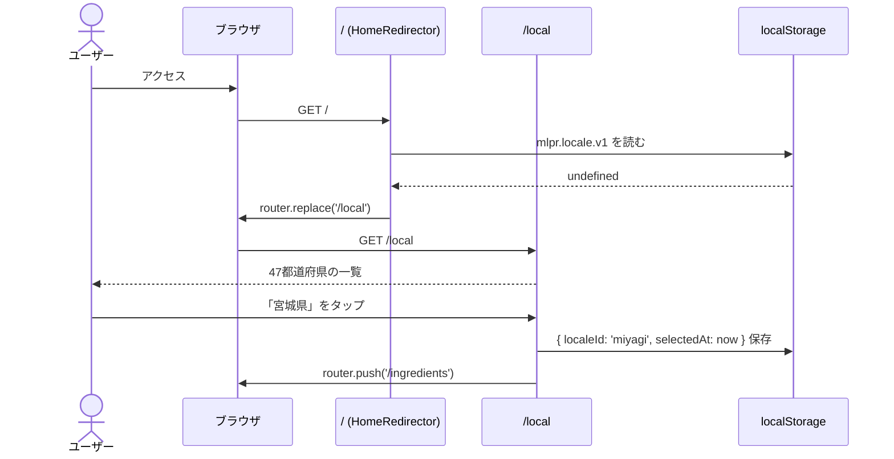
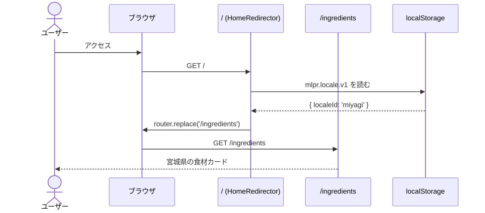
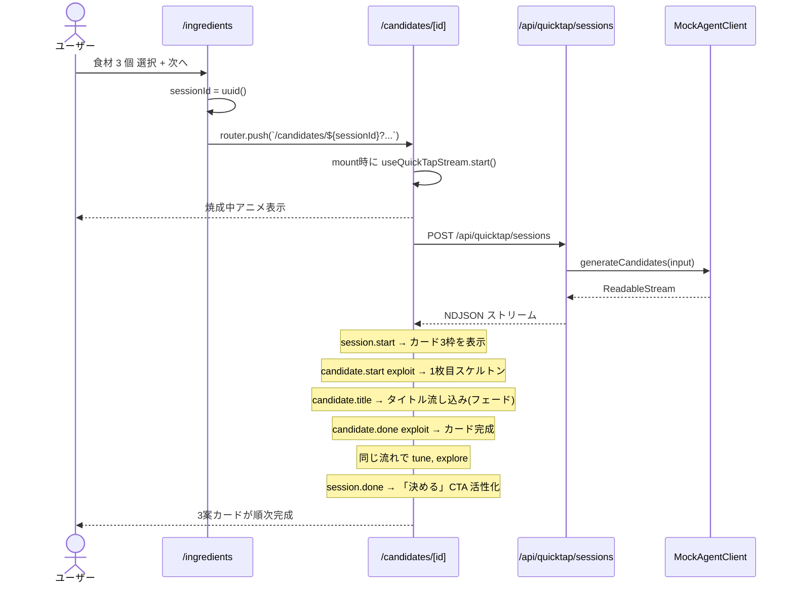
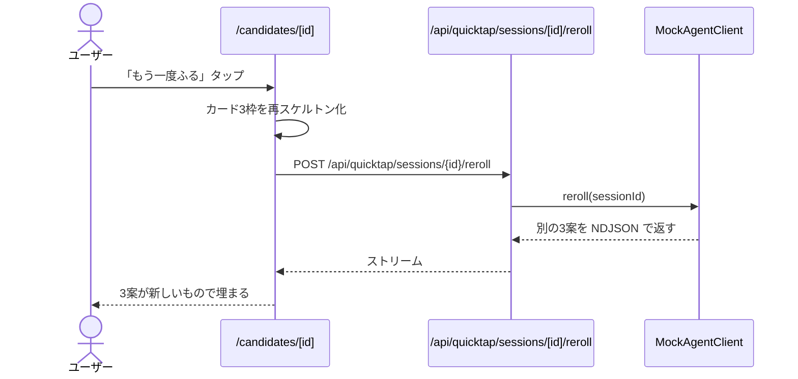

# 初回実装 設計書(Slice 1: Foundation + Quick Tap UI スケルトン + 候補3案モック)

> 本書は [`requirements.md`](requirements.md) に対応する実装設計を定義する。
> アーキテクチャ全体方針は [`docs/architecture.md`](../../docs/architecture.md)、リポジトリ構造は [`docs/repository-structure.md`](../../docs/repository-structure.md)、機能仕様は [`docs/functional-design.md`](../../docs/functional-design.md) を参照。
> タスク分解は同ディレクトリの [`tasklist.md`](tasklist.md) を参照。

---

## 1. 設計の全体方針

### 1.1 4つの設計判断

| # | 判断 | 理由 |
| --- | --- | --- |
| 1 | **NDJSON 契約を最初から本番形式に揃える** | Slice 2 で Python Agent に差し替える際、UI 側コードに変更が出ないようにする |
| 2 | **静的データを `src/data/ingredients.generated.json` にビルド時生成** | YAML を Single Source of Truth にし、TS と Python の両方から同じデータを使える構造を最初から敷く |
| 3 | **localStorage アクセスを単一フック (`useLocale`) に集約** | テスト容易性 + SSR ハイドレーション問題の局所化 |
| 4 | **モック候補生成も `src/lib/agent/mock-candidates.ts` に独立** | 本番の Agent クライアントとインターフェースを揃え、差し替え可能にする |

### 1.2 Slice 1 が決めること / 決めないこと

| カテゴリ | Slice 1 で確定 | 後続スライスで詰める |
| --- | --- | --- |
| **NDJSON イベント形式** | 確定(以下 §5.4) | — |
| **localStorage キー名** | 確定(`mlpr.locale.v1` 等) | — |
| **戦略軸 ID** | 確定(`exploit`/`tune`/`explore` 小文字英語) | — |
| **食材データのスキーマ** | 確定(以下 §5.2) | データ拡充は他スライス |
| **画面構成 01〜04** | 確定 | 05〜07 は他スライス |
| **API パス** | 確定(`/api/quicktap/*` 等) | 認証ヘッダの本番ロジックは Slice 4 |
| **CSS 変数命名** | 確定 | 追加トークンは都度 |
| **Python Agent インターフェース** | **決めない**(Slice 2 で決定) | — |
| **Firestore スキーマ** | **決めない** | Slice 4 |

---

## 2. プロジェクトブートストラップの設計

### 2.1 初期化手順

`create-next-app` 直叩きではなく、**手動でファイルを揃える**方針を取る。理由:

- `docs/repository-structure.md` で定義した構造に従いたい(`create-next-app` の標準構造は微妙にズレる)
- 不要な依存(testing-library 等)を最初から入れたくない
- TS / ESLint / Prettier / Vitest の設定を本プロジェクト独自にしたい

具体的手順は [`tasklist.md`](tasklist.md) で順序立てる。

### 2.2 採用バージョン(`.nvmrc` / `package.json` に固定)

| 項目 | バージョン |
| --- | --- |
| Node.js | 22 LTS(現時点最新の LTS) |
| pnpm | 10.x |
| Next.js | 16.x |
| React | 19.x |
| TypeScript | 5.x |
| Vitest | 2.x |
| ESLint | 9.x(flat config) |

### 2.3 `package.json` スクリプト設計

| スクリプト | コマンド | 用途 |
| --- | --- | --- |
| `dev` | `next dev` | 開発サーバー |
| `build` | `next build` | プロダクションビルド |
| `prebuild` | `node scripts/build-ingredient-data.mjs` | YAML → JSON 生成(自動) |
| `start` | `next start` | プロダクション起動 |
| `lint` | `eslint .` | Lint |
| `lint:fix` | `eslint . --fix` | Lint 自動修正 |
| `typecheck` | `tsc --noEmit` | 型チェック |
| `test` | `vitest run` | テスト 1 回実行(CI) |
| `test:watch` | `vitest` | テスト watch |
| `format` | `prettier --write .` | フォーマット適用 |
| `format:check` | `prettier --check .` | フォーマット検査 |
| `build:data` | `node scripts/build-ingredient-data.mjs` | YAML → JSON 単発実行 |

---

## 3. ディレクトリ構造(Slice 1 終了時点)

`docs/repository-structure.md §2` の**部分集合**を実装する。Slice 1 では実装しない領域は **作成しない**:

```
MakeLocalPizzaRecipeAgent/
├── app/
│   ├── layout.tsx
│   ├── page.tsx                          # / → 初回判定 → リダイレクト
│   ├── globals.css
│   ├── not-found.tsx
│   ├── local/page.tsx                    # 01
│   ├── ingredients/page.tsx              # 02
│   ├── candidates/[sessionId]/page.tsx   # 03+04(焼成中はクライアントコンポーネント内で処理)
│   └── api/
│       ├── health/route.ts
│       ├── locales/
│       │   ├── route.ts
│       │   └── [id]/ingredients/route.ts
│       └── quicktap/
│           └── sessions/
│               ├── route.ts
│               └── [id]/reroll/route.ts
│
├── src/
│   ├── domain/
│   │   ├── locale.ts
│   │   ├── ingredient.ts
│   │   ├── candidate.ts
│   │   └── schemas.ts                    # Zod
│   ├── lib/
│   │   ├── agent/
│   │   │   ├── client.ts                 # AgentClient インターフェース (Slice 2 で本実装に差し替え)
│   │   │   ├── mock-candidates.ts        # スタブ実装
│   │   │   └── stream.ts                 # NDJSON ストリームヘルパ
│   │   ├── localstorage/
│   │   │   └── locale.ts                 # キー名定数 + R/W 関数
│   │   ├── observability/
│   │   │   ├── logger.ts
│   │   │   └── span.ts                   # withSpan(no-op 実装でも構造維持)
│   │   └── http/
│   │       ├── error.ts
│   │       └── with-auth.ts              # withAuthOptional の雛形(認証ロジックは Slice 4)
│   ├── stores/
│   │   └── quicktap.ts                   # Zustand
│   ├── components/
│   │   ├── primitives/
│   │   │   ├── Button.tsx
│   │   │   ├── Chip.tsx
│   │   │   └── Card.tsx
│   │   ├── local/
│   │   │   ├── PrefectureGrid.tsx
│   │   │   └── RegionChip.tsx
│   │   ├── ingredient/
│   │   │   ├── IngredientCard.tsx
│   │   │   ├── SeasonTab.tsx
│   │   │   └── CategoryTab.tsx
│   │   ├── candidate/
│   │   │   ├── CandidateCard.tsx
│   │   │   └── StrategySeal.tsx
│   │   ├── loading/
│   │   │   └── BakingAnimation.tsx
│   │   └── illustration/
│   │       ├── PizzaDisk.tsx             # design/pizza-tokens.jsx から移植
│   │       └── WashiTexture.tsx
│   ├── hooks/
│   │   ├── use-locale.ts                 # localStorage 連動
│   │   └── use-quicktap-stream.ts        # NDJSON ストリーム受信
│   ├── data/
│   │   └── ingredients.generated.json    # ビルド時に生成
│   └── styles/
│       ├── tokens.css                    # CSS 変数
│       ├── washi-noise.css               # 紙質感
│       └── fonts.css                     # font-face 宣言(必要時)
│
├── agent/                                # Slice 2 用に空骨格のみ作る(任意)
│   └── data/
│       └── ingredients.yaml              # 静的データの正本
│
├── design/                               # 既に配置済み
├── docs/                                 # 既に配置済み
├── public/
│   ├── og.png                            # プレースホルダ
│   └── favicon.ico
├── scripts/
│   └── build-ingredient-data.mjs         # YAML → JSON
├── tests/
│   └── e2e/                              # Slice 1 では空 or スモーク1本のみ
├── .github/workflows/ci.yml
├── .env.example
├── .gitignore
├── .dockerignore
├── .nvmrc
├── .editorconfig
├── .prettierrc
├── .prettierignore
├── eslint.config.mjs
├── tsconfig.json
├── next.config.ts
├── package.json
├── pnpm-lock.yaml
├── lefthook.yml
├── vitest.config.ts
├── Dockerfile                            # Web/BFF 用
├── README.md
└── CLAUDE.md                             # 既存
```

**作らない**(Slice 1 範囲外):

- `app/(auth)/` `app/recipes/` `app/pizza-book/`
- `src/lib/firebase/` `src/lib/firestore/` `src/lib/storage/`
- `src/components/recipe/` `src/components/feedback/`
- `agent/src/` `agent/scripts/` `agent/tests/`(`agent/data/` のみ)
- `infra/` 全般
- `.steering/` の他作業ディレクトリ

---

## 4. デザイントークン移植の設計

### 4.1 移植対象

`design/pizza-tokens.jsx` の以下を本実装へ移す:

1. **`T` オブジェクト**(配色 / 戦略色 / フォント名 / 余白)→ `src/styles/tokens.css` の CSS 変数へ
2. **`WASHI_NOISE` 定数**(SVG noise pattern) → `src/styles/washi-noise.css` の `background-image`
3. **`Washi` コンポーネント**(washi 紙の背景) → `src/components/illustration/WashiTexture.tsx`
4. **`Icon` / `Chip` / `StrategySeal` コンポーネント** → `src/components/primitives/` / `src/components/candidate/`
5. **`PizzaDisk` / `Pizzas` コンポーネント**(ピザのイラスト) → `src/components/illustration/PizzaDisk.tsx`

### 4.2 CSS 変数命名規則

`T` オブジェクトのキー名をそのまま `--mlpr-<key>` にする:

```css
:root {
  /* surfaces */
  --mlpr-washi: #F2E9D6;
  --mlpr-washi-soft: #F7F0DE;
  --mlpr-washi-deep: #E8DDC4;
  --mlpr-kinari: #FBF7ED;
  --mlpr-sumi: #1F1A12;
  --mlpr-sumi-soft: #5A4E3E;
  --mlpr-sumi-muted: #928571;
  --mlpr-hairline: rgba(31, 26, 18, 0.10);

  /* accents */
  --mlpr-shu: #C8412A;
  --mlpr-shu-deep: #9F3220;
  --mlpr-shu-pale: #F2D9CC;
  --mlpr-yamabuki: #DC8A2A;
  --mlpr-matcha: #607744;
  --mlpr-ai: #3E5670;
  --mlpr-kogane: #BE934A;
  --mlpr-mokushi: #8B5A2B;

  /* strategy */
  --mlpr-exploit-ink: #9F3220;
  --mlpr-exploit-bg: #F4E2D9;
  --mlpr-tune-ink: #8A5A1F;
  --mlpr-tune-bg: #F4E5CD;
  --mlpr-explore-ink: #3E5670;
  --mlpr-explore-bg: #DDE2EB;

  /* typography */
  --mlpr-font-mincho: 'Shippori Mincho B1', serif;
  --mlpr-font-gothic: 'Zen Kaku Gothic New', sans-serif;
  --mlpr-font-mono: 'JetBrains Mono', monospace;
}
```

`--mlpr-` プレフィックスを付けることで、将来 design system を他で混在させても衝突しない。

### 4.3 フォントの読み込み

`app/layout.tsx` で `next/font/google` を使う:

```tsx
import { Shippori_Mincho_B1, Zen_Kaku_Gothic_New, JetBrains_Mono } from 'next/font/google';

const mincho = Shippori_Mincho_B1({ subsets: ['latin'], weight: ['500', '600', '700'], variable: '--mlpr-font-mincho' });
const gothic = Zen_Kaku_Gothic_New({ subsets: ['latin'], weight: ['400', '500', '700'], variable: '--mlpr-font-gothic' });
const mono = JetBrains_Mono({ subsets: ['latin'], weight: ['400', '500'], variable: '--mlpr-font-mono' });
```

CSS 変数として渡し、`tokens.css` の `var(--mlpr-font-mincho)` で参照する。

---

## 5. データ構造設計

### 5.1 ドメイン型

#### `src/domain/locale.ts`

```ts
export type LocaleId = string; // 例: "miyagi" or "miyagi-sendai"

export type Locale = {
  id: LocaleId;
  prefecture: string;       // 例: "宮城県"
  prefectureCode: string;   // ISO 3166-2:JP 形式 例: "JP-04"
  region: Region;           // 地域
  cities?: City[];          // 市町村(MVP では空配列も許容)
};

export type City = {
  id: string;
  name: string;             // 例: "仙台市"
};

export type Region =
  | 'hokkaido'
  | 'tohoku'
  | 'kanto'
  | 'chubu'
  | 'kinki'
  | 'chugoku'
  | 'shikoku'
  | 'kyushu-okinawa';
```

#### `src/domain/ingredient.ts`

```ts
export type IngredientId = string;

export type Season = 'spring' | 'summer' | 'autumn' | 'winter' | 'all-year';
export type IngredientCategory = 'vegetable' | 'seafood' | 'cheese' | 'grain' | 'meat' | 'fruit';

export type Ingredient = {
  id: IngredientId;
  localeId: LocaleId;
  name: string;             // 表示用 例: "せり(根付き)"
  searchQuery?: string;     // 楽天API用 (Slice 5)
  category: IngredientCategory;
  seasons: Season[];        // 複数の旬を許容
  story?: string;           // 一行ストーリー(候補注釈用)
};
```

#### `src/domain/candidate.ts`

```ts
export type Strategy = 'exploit' | 'tune' | 'explore';

export type StrategyLabel = {
  strategy: Strategy;
  japaneseLabel: string;    // "王道" | "一歩外す" | "大冒険"
  inkColor: string;         // CSS 変数値
  bgColor: string;
};

export const STRATEGY_LABELS: Record<Strategy, StrategyLabel> = {
  exploit: { strategy: 'exploit', japaneseLabel: '王道',     inkColor: 'var(--mlpr-exploit-ink)', bgColor: 'var(--mlpr-exploit-bg)' },
  tune:    { strategy: 'tune',    japaneseLabel: '一歩外す', inkColor: 'var(--mlpr-tune-ink)',    bgColor: 'var(--mlpr-tune-bg)' },
  explore: { strategy: 'explore', japaneseLabel: '大冒険',   inkColor: 'var(--mlpr-explore-ink)', bgColor: 'var(--mlpr-explore-bg)' },
};

export type Candidate = {
  candidateId: string;
  strategy: Strategy;
  title: string;
  concept: string;          // 一行コンセプト
  keyIngredients: string[]; // 食材名(表示用)
  sceneTags: string[];      // 例: ["ワインに合う", "週末家族"]
  why: string;              // 「なぜこの提案か」注釈
};

export type QuickTapSessionPayload = {
  sessionId: string;
  localeId: LocaleId;
  ingredients: IngredientId[];
  candidates: Candidate[];
};
```

### 5.2 静的データ YAML スキーマ

`agent/data/ingredients.yaml` の構造:

```yaml
# 形式: locales[].ingredients[]
locales:
  - id: miyagi
    prefecture: 宮城県
    prefectureCode: JP-04
    region: tohoku
    cities:
      - { id: sendai, name: 仙台市 }
    ingredients:
      - id: miyagi-seri
        name: せり(根付き)
        searchQuery: せり 宮城
        category: vegetable
        seasons: [winter, spring]
        story: 一関の山あいで掘り起こされる、根まで食べる宮城の冬野菜
      - id: miyagi-oyster
        name: 牡蠣
        searchQuery: 牡蠣 宮城
        category: seafood
        seasons: [winter]
        story: 松島湾の旨味を凝縮、生でも蒸しても主役級
      # ... 計 10 件
  - id: nagano
    # ...
  - id: kochi
    # ...
```

### 5.3 静的データ JSON 出力

`src/data/ingredients.generated.json` は YAML の構造をそのまま JSON 化したもの。スクリプトは `scripts/build-ingredient-data.mjs`:

```javascript
import { readFile, writeFile } from 'node:fs/promises';
import yaml from 'js-yaml';
import { z } from 'zod';

const LocalesYamlSchema = z.object({
  locales: z.array(/* ... */),
});

const yamlText = await readFile('agent/data/ingredients.yaml', 'utf8');
const parsed = LocalesYamlSchema.parse(yaml.load(yamlText));
await writeFile('src/data/ingredients.generated.json', JSON.stringify(parsed, null, 2));
```

依存: `js-yaml` `zod`(dev dependencies)。

### 5.4 NDJSON ストリーム契約

`POST /api/quicktap/sessions` のレスポンス。1 行 1 JSON、UTF-8、`Content-Type: application/x-ndjson`:

```jsonl
{"type":"session.start","sessionId":"sess_xxx","strategies":["exploit","tune","explore"]}
{"type":"candidate.start","strategy":"exploit","candidateId":"c_1"}
{"type":"candidate.title","candidateId":"c_1","title":"仙台牡蠣とせりの白ピザ"}
{"type":"candidate.concept","candidateId":"c_1","concept":"冬の松島湾を一枚に閉じ込めた、王道の組合せ"}
{"type":"candidate.ingredients","candidateId":"c_1","ingredients":["牡蠣","せり","モッツァレラ"]}
{"type":"candidate.sceneTags","candidateId":"c_1","sceneTags":["ワインに合う","ビジネス会食"]}
{"type":"candidate.why","candidateId":"c_1","why":"過去FBの傾向に沿った堅実な組合せです"}
{"type":"candidate.done","candidateId":"c_1"}
{"type":"candidate.start","strategy":"tune","candidateId":"c_2"}
... (tune, explore も同様)
{"type":"session.done","sessionId":"sess_xxx"}
```

#### 5.4.1 Zod スキーマ

`src/domain/schemas.ts` に discriminated union として定義:

```ts
import { z } from 'zod';

export const StreamEventSchema = z.discriminatedUnion('type', [
  z.object({ type: z.literal('session.start'), sessionId: z.string(), strategies: z.array(z.enum(['exploit', 'tune', 'explore'])) }),
  z.object({ type: z.literal('candidate.start'), strategy: z.enum(['exploit', 'tune', 'explore']), candidateId: z.string() }),
  z.object({ type: z.literal('candidate.title'), candidateId: z.string(), title: z.string() }),
  z.object({ type: z.literal('candidate.concept'), candidateId: z.string(), concept: z.string() }),
  z.object({ type: z.literal('candidate.ingredients'), candidateId: z.string(), ingredients: z.array(z.string()) }),
  z.object({ type: z.literal('candidate.sceneTags'), candidateId: z.string(), sceneTags: z.array(z.string()) }),
  z.object({ type: z.literal('candidate.why'), candidateId: z.string(), why: z.string() }),
  z.object({ type: z.literal('candidate.done'), candidateId: z.string() }),
  z.object({ type: z.literal('session.done'), sessionId: z.string() }),
  z.object({ type: z.literal('error'), code: z.string(), message: z.string() }),
]);
export type StreamEvent = z.infer<typeof StreamEventSchema>;
```

#### 5.4.2 段階表示の演出

候補画面では受信した順序で UI を埋めていく:

- `candidate.start` で空のカードを作る
- `candidate.title` でタイトル流し込み(フェードイン)
- `candidate.concept` で 1 行コンセプト追加
- `candidate.ingredients` でチップ追加
- `candidate.done` でカードを「決定可能」状態に

イベント間に意図的な遅延(モック実装で各 200〜400ms)を入れ、本番のストリームに見える演出を作る。

### 5.5 localStorage キー設計

[`functional-design.md §3.4`](../../docs/functional-design.md#34-端末ローカルlocalstorage-設計) と一致:

| キー | 型 | 例 |
| --- | --- | --- |
| `mlpr.locale.v1` | `{ localeId: string; selectedAt: number }` | `{"localeId":"miyagi","selectedAt":1736743200000}` |
| `mlpr.recentIngredients.v1` | `string[]`(最大 20) | `["miyagi-seri","miyagi-oyster"]` |
| `mlpr.guestSessionId.v1` | `string`(UUID v4) | `"guest_a1b2c3..."` |

すべて `src/lib/localstorage/locale.ts` の R/W 関数経由。バージョン番号は将来のマイグレーション用。

---

## 6. モジュール設計

### 6.1 `src/lib/agent/client.ts` — AgentClient インターフェース

```ts
import { type Strategy, type Candidate } from '@/domain/candidate';
import { type LocaleId, type IngredientId } from '@/domain/...';

export type GenerateCandidatesInput = {
  localeId: LocaleId;
  ingredients: IngredientId[];
  guestSessionId?: string;
  userId?: string;            // Slice 4 で使う
};

export interface AgentClient {
  generateCandidates(input: GenerateCandidatesInput): Promise<ReadableStream<Uint8Array>>;
  reroll(sessionId: string): Promise<ReadableStream<Uint8Array>>;
}
```

Slice 1 では `MockAgentClient`(`mock-candidates.ts`) が実装する。Slice 2 で `HttpAgentClient`(本物の Python Agent を叩く) を追加し、`process.env.AGENT_MODE === 'mock' ? MockAgentClient : HttpAgentClient` で切替可能にする。

### 6.2 `src/lib/agent/mock-candidates.ts` — スタブ実装

- 食材 ID の組合せから決定論的に 3 案を組み立てる(テストでスナップショット可能にするため)
- 戦略軸ごとに**異なるテンプレート**を持つ:
  - Exploit: 「○○ と △△ の白ピザ」「冬の◯◯を一枚に」
  - Tune: 「○○ と △△ の柑橘アクセント」「酸味を引き出す◯◯ピザ」
  - Explore: 「○○ × チョコレートピザ」「意外性追求の◯◯」
- 各 NDJSON イベントを 200〜400ms 間隔で `controller.enqueue(...)` する `ReadableStream` を返す

### 6.3 `src/lib/agent/stream.ts` — NDJSON ストリームヘルパ

両方向のヘルパを 1 ファイルに集約:

```ts
// サーバー側(BFF): イベント配列 → ReadableStream<Uint8Array>
export function encodeNdjsonStream(events: AsyncIterable<StreamEvent>): ReadableStream<Uint8Array>;

// クライアント側(UI): ReadableStream<Uint8Array> → AsyncGenerator<StreamEvent>
export async function* decodeNdjsonStream(stream: ReadableStream<Uint8Array>): AsyncGenerator<StreamEvent>;
```

実装は `TextEncoderStream` / `TextDecoderStream` + 行バッファリング。

### 6.4 `src/hooks/use-quicktap-stream.ts`

```ts
export function useQuickTapStream(): {
  state: 'idle' | 'streaming' | 'done' | 'error';
  candidates: PartialCandidate[];  // 段階的に埋まる
  sessionId: string | null;
  start: (input: GenerateCandidatesInput) => void;
  reroll: () => void;
};
```

内部で `fetch('/api/quicktap/sessions', { ... })` → `decodeNdjsonStream` → `useReducer` でカード状態を更新。

### 6.5 `src/hooks/use-locale.ts`

```ts
export function useLocale(): {
  locale: Locale | null;    // ロード完了まで null
  setLocale: (l: Locale) => void;
  clearLocale: () => void;
  isHydrated: boolean;      // SSR ハイドレーション完了フラグ
};
```

`useSyncExternalStore` で localStorage を subscribe。SSR 中は `null` を返し、ハイドレーション後に値を出す(SSR/CSR 不整合を防ぐ)。

### 6.6 `src/stores/quicktap.ts` — Zustand

```ts
type QuickTapState = {
  selectedIngredients: IngredientId[];
  toggle: (id: IngredientId) => void;
  clear: () => void;
};
```

食材選択画面で使う一時状態のみ。永続化しない。Tap2 → Tap3 の遷移時に URL or sessionStorage で運ぶ。

---

## 7. ルーティング設計

### 7.1 ルートと初回判定

| パス | 動作 |
| --- | --- |
| `/` | Server Component で何もしない。`<HomeRedirector />` Client Component が localStorage を見て `/local` or `/ingredients` にナビゲート |
| `/local` | 01 地元選択 |
| `/ingredients` | 02 食材選択 |
| `/candidates/[sessionId]` | 03 焼成中 + 04 候補3案 (内部で状態切替) |
| `/api/...` | BFF ルートハンドラ |

### 7.2 セッション ID の払い出し

Tap2 で「次へ」を押した時に **クライアント側で UUID v4 を生成** し、`/api/quicktap/sessions` に POST 時に `sessionId` として送る。サーバー側はそのまま使う(MVP では永続化しない)。

`/candidates/[sessionId]` のページが mount すると `useQuickTapStream` を介して再リクエスト ... ではなく、Tap2 → /candidates 遷移時にフェッチを開始して、URL パラメータと連動させる(初回ロード時にすぐリクエストする)。

具体的には:
1. Tap2「次へ」押下 → クライアント側で `sessionId` 生成
2. `router.push('/candidates/' + sessionId + '?ingredients=...')` で遷移(食材リストはクエリパラメータ or sessionStorage 経由)
3. `/candidates/[sessionId]` のクライアントコンポーネントが mount で fetch 開始

### 7.3 SSR / RSC の境界

- ルートレイアウト `app/layout.tsx`: Server Component
- 各 `page.tsx`: 必要最小限のサーバーロジック(基本は Client Component を内包)
- 食材選択・候補画面・地元選択は **Client Component**(`'use client'`)
  - localStorage / fetch / Zustand を使うため
- BFF API ルートはすべて Server-side のみ

---

## 8. 主要シーケンス

### 8.1 初回起動



### 8.2 リピート起動



### 8.3 Tap2 → 候補画面(ストリーム表示)



### 8.4 振り直し



---

## 9. テスト戦略

### 9.1 ユニットテスト(Vitest)— 5 本以上

| テスト | 対象ファイル | 内容 |
| --- | --- | --- |
| 1 | `src/lib/agent/stream.test.ts` | `encodeNdjsonStream` / `decodeNdjsonStream` の往復、行バッファリング、不正 JSON のエラー |
| 2 | `src/lib/agent/mock-candidates.test.ts` | 同じ入力 → 同じ 3 案(決定論)、戦略軸が必ず exploit/tune/explore で揃う |
| 3 | `src/lib/localstorage/locale.test.ts` | R/W、バージョン番号、broken JSON のリカバリ |
| 4 | `src/domain/schemas.test.ts` | NDJSON イベントの discriminated union 境界値 |
| 5 | `src/hooks/use-locale.test.ts` | SSR 時 null、hydration 後値表示、setLocale で更新 |

### 9.2 E2E(Playwright)

Slice 1 では**手動受け入れ**で代替。Playwright E2E は Slice 6 のデプロイ時にまとめて追加。

ただし `tests/e2e/playwright.config.ts` の雛形は置き、smoke spec を 1 本だけ(`/api/health` を叩く程度)用意。

### 9.3 モック方針

- `MockAgentClient` がテスト用にも本番用にも使える(テスト固有のモックは作らない)
- localStorage は jsdom のものを使う(`vitest.config.ts` で `environment: 'jsdom'`)
- API ルートのテストは `next/server` の `NextRequest` をモック

---

## 10. CI 設計

### 10.1 `.github/workflows/ci.yml`

```yaml
name: CI
on:
  pull_request:
  push:
    branches: [main]

jobs:
  node:
    runs-on: ubuntu-latest
    steps:
      - uses: actions/checkout@v4
      - uses: pnpm/action-setup@v4
        with: { version: 10 }
      - uses: actions/setup-node@v4
        with: { node-version: 22, cache: pnpm }
      - run: pnpm install --frozen-lockfile
      - run: pnpm lint
      - run: pnpm typecheck
      - run: pnpm test
      - run: pnpm build
```

### 10.2 lefthook 設定

```yaml
pre-commit:
  parallel: true
  commands:
    eslint:
      glob: "*.{ts,tsx,js,mjs}"
      run: pnpm eslint {staged_files}
    prettier:
      glob: "*.{ts,tsx,js,mjs,json,md,css}"
      run: pnpm prettier --check {staged_files}
    typecheck:
      run: pnpm typecheck
    gitleaks:
      run: gitleaks protect --staged --redact --no-banner
```

---

## 11. 影響範囲分析

ゼロベースの実装なので**「新規作成のみ」**。既存ファイルへの影響:

| 既存ファイル | 影響 |
| --- | --- |
| `CLAUDE.md` | 変更なし |
| `docs/*.md` | 変更なし(本スライス内で永続ドキュメントは触らない) |
| `design/*` | 変更なし(参照のみ) |

---

## 12. 設計上のリスク・トレードオフ

| # | 検討事項 | 採用判断 | 理由 |
| --- | --- | --- | --- |
| 1 | Tap2 → Tap3 の状態渡しを URL パラメータ vs sessionStorage | **URL パラメータ + sessionStorage 併用** | URL でリロード復元可能、長い場合は sessionStorage に逃がす |
| 2 | NDJSON vs SSE(Server-Sent Events) | **NDJSON** | レスポンス形式の自由度が高く、TS/Python 両方で楽 |
| 3 | モック候補生成の決定論 vs ランダム | **決定論(食材ID組合せから seed)** | テスト容易性。「もう一度ふる」のみ seed をずらす |
| 4 | Zustand の永続化(persist middleware) | **不採用** | localStorage 連動は `useLocale` フックに集約済み。Zustand persist はもう一層になり過剰 |
| 5 | ピザイラスト(`PizzaDisk`) を SVG inline vs `` | **SVG inline** (design/ と同じ React 描画) | デザインプロトタイプと同じコードを移植できる |
| 6 | 焼成中アニメーションの実装 | **CSS keyframes** | プロトタイプの実装を踏襲、`prefers-reduced-motion` 対応 |
| 7 | API ルートで Zod parse 失敗時の応答 | **400 + `{error:{code,message}}`** | development-guidelines §6.3 と整合 |
| 8 | `withAuthOptional` の Slice 1 動作 | **常にゲストとして通す**(認証なしで `userId: undefined`) | 後で Slice 4 で実装差し替え時にインターフェースを揃える |

---

## 13. 改訂履歴

| 日付 | 版 | 変更内容 |
| --- | --- | --- |
| 2026-05-13 | 1.0 | 初版作成。Slice 1 の具体的な実装設計を確定。NDJSON 契約・localStorage キー・ディレクトリ構造・テスト戦略・主要シーケンスを定義。 |
