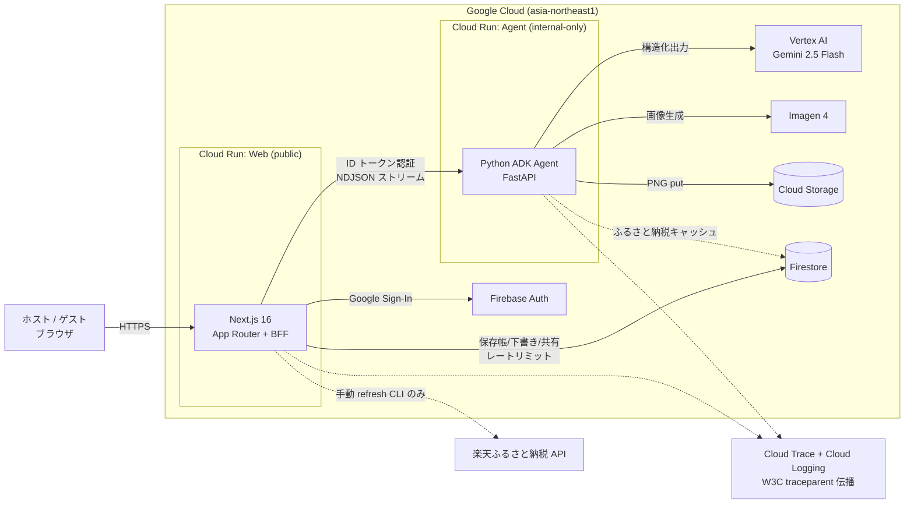
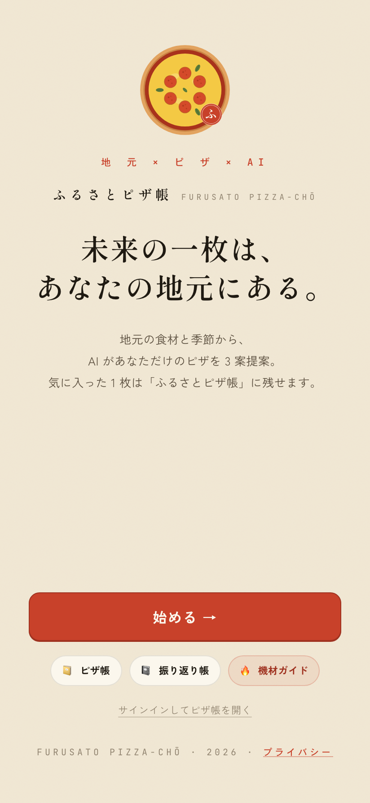
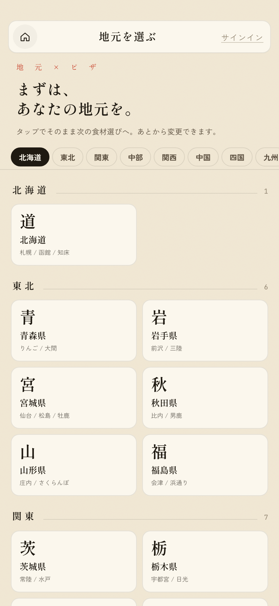
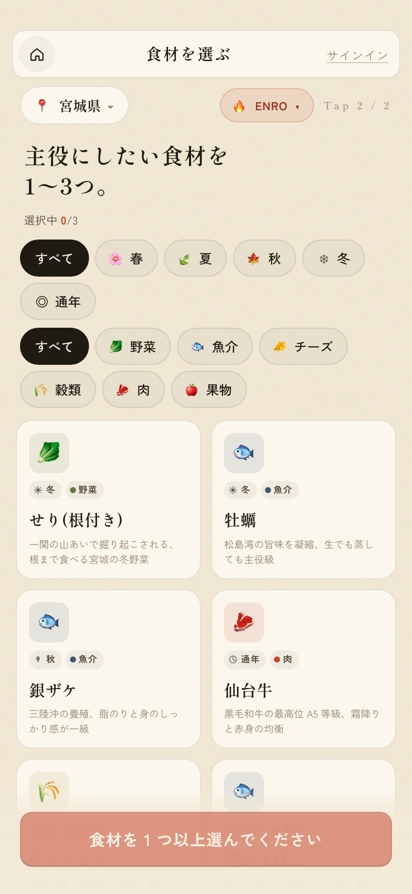
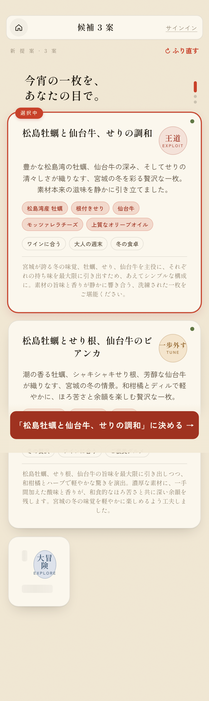
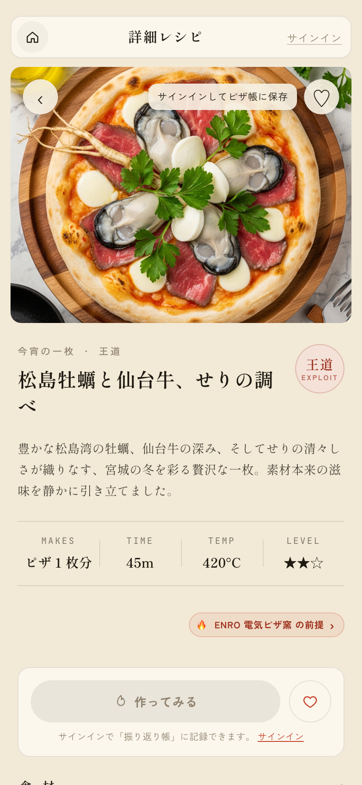
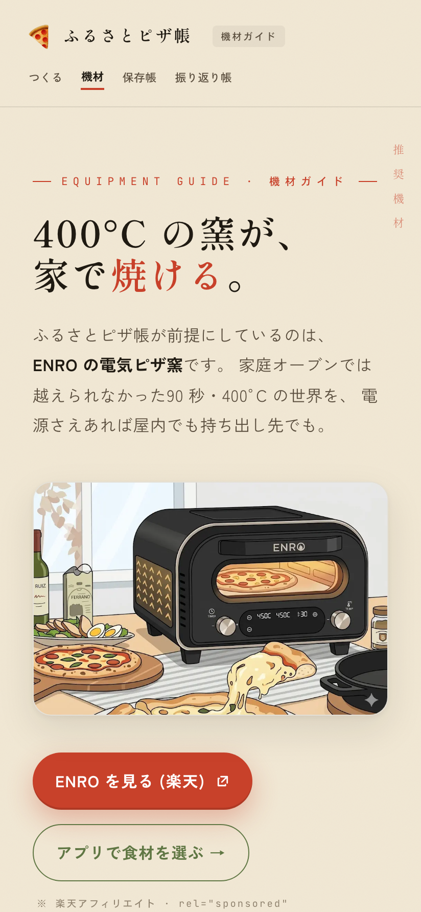

# ふるさとピザ帳 (Make Local Pizza Recipe Agent)

地元 × 旬の食材を起点に、**AI エージェント**が「王道 / 一歩外す / 大冒険」の 3 軸でピザレシピを
即座に提案し、作って・記録して・共有するまでを支える Web アプリ。

> **DevOps × AI Agent Hackathon 2026** 応募作品。
> ホストが「今夜の一枚」に迷う時間を、地元食材を活かした独創的な 1 枚との出会いに変える。

## 🔗 公開 URL（審査員向け）

- **Web アプリ: <https://furusato-pizza.jp>** （本番 Cloud Run / `asia-northeast1`）
- Agent: 非公開（`internal-only` ingress、Web の SA からのみ ID トークン経由でアクセス）

## ✅ ハッカソン必須技術の充足

| 区分 | 要件 | 本作品での利用 |
| --- | --- | --- |
| 4.1 アプリ実行基盤 | Cloud Run 等を 1 つ以上 | **Cloud Run × 2**（Web/BFF + Agent を分離、`asia-northeast1`） |
| 4.2 Google Cloud AI | Vertex / Gemini / Imagen / ADK 等を 1 つ以上 | **Vertex AI Gemini 2.5 Flash**（候補 + 詳細生成）/ **Imagen 4**（仕上がり画像）/ **ADK**（エージェント実装） |

## 🏗️ システムアーキテクチャ



- **AI エージェントが中核**: 食材から 3 戦略を**並列**生成し、詳細レシピとストーリー・画像までを
  自律的に組み立てる。プロンプト戦略・機材プロファイル・過去フィードバックで出力を出し分ける。
- **DevOps フルサイクル**: Terraform IaC / GitHub Actions CI + Cloud Build CD（main push → 自動デプロイ、
  WIF キーレス）/ Cloud Trace + Cloud Logging で Web ⇄ Agent のトレースを相互リンク。
- 詳細設計は [docs/architecture.md](docs/architecture.md) / [docs/functional-design.md](docs/functional-design.md) を参照。

---

## 📸 画面

> 本番環境 <https://furusato-pizza.jp> の実画面（地元 → 食材 → 候補3案 → 詳細レシピ の主動線）。

| 1. TOP | 2. 地元選択 | 3. 食材選択 |
| :---: | :---: | :---: |
| [](docs/images/screenshots/01-top.png) | [](docs/images/screenshots/02-local.png) | [](docs/images/screenshots/03-ingredients.png) |
| 「未来の一枚は、あなたの地元にある。」 | 47 都道府県から地元を選ぶ | 旬・カテゴリで食材を絞り複数選択 |

| 4. 候補 3 案 | 5. 詳細レシピ + 画像 | 6. 機材ガイド |
| :---: | :---: | :---: |
| [](docs/images/screenshots/04-candidates.png) | [](docs/images/screenshots/05-detail.png) | [](docs/images/screenshots/06-equipment.png) |
| 王道 / 一歩外す / 大冒険 を NDJSON で順次生成 | 産地ストーリー + Imagen 仕上がり画像 | ENRO 推奨機材の LP（`/equipment`） |

---

## 機能

- ✅ **TOP ページ** — 初回訪問者には「未来の一枚は、あなたの地元にある。」+ 「始める →」、リピーターは /local に自動再開、サインイン済は /library に直行
- ✅ **地元選択** — 47 都道府県 (現状はキュレーション 3 県)
- ✅ **食材選択** — 季節 / カテゴリでフィルタ、複数選択
- ✅ **候補 3 案の段階表示** — NDJSON ストリームで `王道 / 一歩外す / 大冒険` を順次焼き上げ
- ✅ **振り直し** — 別 seed で 3 案を再生成
- ✅ **本物の Gemini Agent** (Python ADK + Vertex Gemini 2.5 Flash) — Slice 2 で実装
- ✅ **詳細レシピ + Imagen 画像生成** — Slice 3 で実装。テキストは Gemini Flash、画像は Imagen 4 を並列実行 (テキスト先 → 画像後の体験)
- ✅ **Google サインイン** — Firebase Auth (Google Sign-In)。各画面の右上「サインイン」リンク / アバターから Modal 起動
- ✅ **ピザ帳 (Firestore)** — 詳細画面のハートで `users/{uid}/savedRecipes/{candidateId}` に保存。`/library` で savedAt 降順一覧、ハート再 tap で解除
- ✅ **GCS Storage 連動** — Python `image_agent` が Imagen の PNG を Firebase Storage に put し、`image.ready { url }` で配信 (Slice 4 で `dataUri` から URL に移行)
- ✅ **Toast / SignInModal / AvatarButton** — Provider ベースのグローバル UI 基盤
- ✅ **Security Rules** — Firestore: 本人のみ自分の savedRecipes を R/W、furusato_items は public read / client write 不可、Storage: recipes/ public read + client write 不可。`pnpm test:rules` で Emulator 相手にユニットテスト
- ✅ **楽天ふるさと納税連動** (Slice 5) — 詳細レシピ画面に「取 寄 / FURUSATO」セクション。3 層分離 (YAML キュレーション / refresh CLI / Firestore キャッシュ) で楽天 API は手動 refresh からのみ叩く。Web は Firestore を直 read。Card B inline (sumi BG CTA / RAKUTEN chip / クレジット表記)
- ✅ **Cloud Run 本番デプロイ** (Slice 6) — Web (public) + Agent (internal-only) の 2 サービス分離。Web → Agent は Google ID トークン (audience=AGENT_BASE_URL) で認証。`asia-northeast1` 配置、Artifact Registry に image 集約
- ✅ **Terraform IaC** — `infra/terraform/` flat 構造の 1 state。SA × 3 / AR repo / Storage bucket / Secret Manager (楽天キー 3 本) / WIF pool + provider / Cloud Run × 2 をまとめて apply
- ✅ **Cloud Build CI/CD** — main push → GitHub Actions → WIF impersonation → Cloud Build × 2 並列 → Cloud Run 自動 deploy。SA 鍵不要 (OIDC)
- ✅ **Cloud Trace + Cloud Logging** — Next.js `instrumentation.ts` (OTel sdk-node) と Python `lib/observability.py` (OTel + CloudTraceSpanExporter) で W3C traceparent を伝播。Cloud Logging には JSON structured log に `logging.googleapis.com/trace` を inject、Trace と相互リンク
- ✅ **「作ってみた」フィードバック** (Slice 7) — 詳細画面「作ってみる」CTA から `/feedback/[id]` へ。★ (0〜5) + 観点別評価 4 軸 (味 / 見た目 / ストーリー / また作りたい) + 多選択チップ 3 群 (効いた点 / 次は調整したい / ゲストの反応) + ゲスト数 を入力可能。3 秒 debounce で localStorage + Firestore `drafts/{recipeId}` に自動保存
- ✅ **振り返り帳** (Slice 7) — 新ルート `/journal`、フィードバック記録ありレシピを ★ 評価カードで一覧 (cookedAt 降順)。Stat 3 タイル (作った数 / 平均★ / 効いた点トップ) + filter chips + 0 件時の Empty 状態
- ✅ **保存帳 ⇄ 振り返り帳の対** (Slice 7) — `/library` を「保存帳」にリネーム、「作った」サブバッジ表示。両画面間を `CrossLink` ピルで相互ナビ
- ✅ **統一 HeaderRow + Dropdown** (Slice 7) — 全画面 (TOP 除く) に共通の戻る + タイトル + Avatar+▾。Dropdown に「ピザ帳 (保存)」「振り返り帳 (作った)」「サインアウト」。a11y (Esc / ↑↓ / outside click) 対応
- ✅ **ブランド「ふるさとピザ帳」確立** (Slice 7) — FurusatoMark コンポーネント (変型 B 採用、≤18px で A にフォールバック) + Wordmark (horizontal / stacked / vertical) + favicon / apple-touch-icon
- ✅ **機材プロファイル + 機材ガイド** (Slice 8) — 焼成機材 (`ENRO 電気ピザ窯` / `家庭用オーブン`) を
  プロンプトに注入し温度・時間・生地を出し分け。`/equipment` 推奨機材 LP（アフィリエイト透明性注記つき）
- ✅ **アプリ層レートリミット** (Slice 9) — `withRateLimit` で公開 API を `auth > guest > IP` 単位の
  per-hour 課金に。Firestore `rate_limits` (UTC hour bucket / TTL 2h)、超過時 `429` + `Retry-After`。
  あわせて GA4 計測 (`trackEvent`) を導入
- ✅ **共有リンク + OGP** (Slice 10) — 詳細レシピを `/share/[shareId]` の公開ページとして発行
  (未ログイン可・べき等)。`generateMetadata` で Twitter `summary_large_image` カードを生成、X Web Intent へ導線
- 🚧 今後: Vertex AI Gen AI Evaluation / 戦略軸別品質モニタリング / 写真添付の拡充

---

## 技術スタック

| 層             | 採用                                                                                        |
| -------------- | ------------------------------------------------------------------------------------------- |
| フロント       | **Next.js 16** (App Router) / React 19 / TypeScript 5.9                                     |
| 状態           | Zustand 5 / React 19 標準 (`useSyncExternalStore` / `useReducer`)                           |
| バリデーション | Zod 4 (NDJSON / API リクエスト / 静的データ)                                                |
| BFF            | Next.js Route Handlers (Edge ではなく Node ランタイム)                                      |
| デザイン       | 自作トークン (CSS 変数) + CSS Modules / 和紙テクスチャ + 明朝/ゴシック/モノ                 |
| テスト         | Vitest 4 + jsdom + RTL / Playwright 1.60 (smoke のみ)                                       |
| 静的データ     | YAML → Zod 検証 → JSON (build 時に生成、リポジトリ管理)                                     |
| CI             | GitHub Actions (lint / typecheck / test / build / rules (Firebase Emulator) / e2e / Python) |
| pre-commit     | lefthook (eslint / prettier / typecheck / gitleaks)                                         |
| デプロイ       | Cloud Run × 2 (Web public / Agent internal) + Cloud Build + GitHub Actions WIF (v0.6.0)     |
| IaC            | Terraform 1.6+ (google + google-beta providers ~> 6.20)                                     |
| 可観測性       | Cloud Trace (OTel auto-instrumentation Web + Python) + Cloud Logging (JSON structured)      |
| シークレット   | Secret Manager (楽天 API キー 3 本、`value_source.secret_key_ref` で Cloud Run env に注入)  |

---

## 必要環境

- Node.js **22.x** (`.nvmrc` 参照)
- pnpm **10.x**
- DevContainer (推奨): `.devcontainer/` を VS Code または GitHub Codespaces で開く

---

## セットアップ

```bash
# 1. リポジトリをクローン
git clone https://github.com/sugimomoto/MakeLocalPizzaRecipeAgent.git
cd MakeLocalPizzaRecipeAgent

# 2. Web 依存インストール
pnpm install --frozen-lockfile

# 3. lefthook (pre-commit hook) を有効化
pnpm exec lefthook install

# 4. Agent (Python) 依存インストール — Slice 2 以降
cd agent && uv sync --extra dev && cd ..
```

## 開発 — Web のみ (mock agent)

```bash
# 開発サーバ (Turbopack 不調のため webpack を明示)
pnpm dev
# → http://localhost:3000  (AGENT_MODE 未設定 = mock = Python agent 不要)

# テスト (Vitest)
pnpm test
pnpm test:watch

# 型 / Lint / Format
pnpm typecheck
pnpm lint
pnpm format

# 静的データ (YAML → JSON) を手動再生成
pnpm build:data

# プロダクションビルド
pnpm build
```

## 開発 — 本物の Gemini を使う (Slice 2)

Python Agent と Web を 2 ターミナルで並行起動:

```bash
# ── ターミナル 1: Python Agent ──
gcloud auth application-default login --no-launch-browser    # 初回のみ
cd agent
export MLPR_GOOGLE_CLOUD_PROJECT=your-project-id
uv run uvicorn makelocal_agent.main:app --port 8001 --reload
# http://localhost:8001/agent/health → {"ok":true}

# ── ターミナル 2: Web (Next.js) ──
AGENT_MODE=http pnpm dev
# http://localhost:3000 (BFF が Python agent を叩く)
```

`AGENT_MODE=mock` (デフォルト) なら Slice 1 と同じ挙動 (Python 不要)。
オフライン開発したい場合は `MLPR_USE_MOCK_LLM=true` で Python agent 側だけモック化することもできる
(プロンプト構築・スキーマ検証ロジックは本物が走る)。

## 開発 — Firebase Emulator (Slice 4 以降)

ピザ帳保存 (Firestore) / Google サインイン (Auth) / 画像 URL 化 (Storage) を
全てローカル Emulator で動かす。本番 Firebase プロジェクトは Slice 6 (デプロイ時)。

```bash
# ── ターミナル 3: Firebase Emulator ──
firebase emulators:start --project=mlpr-local
# UI: http://localhost:4000
# Auth: 9099 / Firestore: 8080 / Storage: 9199
```

Web 側からは `NEXT_PUBLIC_USE_FIREBASE_EMULATOR=true` で自動接続。
Python Agent 側からは `MLPR_USE_MOCK_STORAGE=false` + `MLPR_FIREBASE_STORAGE_EMULATOR_HOST=localhost:9199` で接続。
詳細は `.env.example` を参照。

> **注:** Python Agent は port **8001** に移行済 (Firestore Emulator の 8080 と被るため)。

### devcontainer の port forward がずれた場合

VS Code の port forward が、コンテナ内 port を host 側で別 port に割り当てる
ことがある (例: 9099 → 9100、8080 → 8081)。Firebase Web SDK は `localhost:9099`
固定でブラウザから popup を開こうとするため、ずれていると popup が接続失敗する。
`.env` で **ホスト側から見える host:port** を指定して上書きする:

```env
NEXT_PUBLIC_FIREBASE_AUTH_EMULATOR_HOST=localhost:9100
NEXT_PUBLIC_FIREBASE_FIRESTORE_EMULATOR_HOST=localhost:8081
# NEXT_PUBLIC_FIREBASE_STORAGE_EMULATOR_HOST=localhost:9199
```

### Security Rules テスト

```bash
# Emulator を起動した別ターミナルがある状態で
pnpm test:rules
```

CI では `firebase emulators:exec --only auth,firestore,storage` で一時起動して走る (`.github/workflows/ci.yml` の `rules` job)。

## 開発 — 楽天ふるさと納税連動 (Slice 5)

詳細レシピ画面の「取 寄 / FURUSATO」セクションは、Firestore `furusato_items/{ingredientId}` を直 read して楽天市場 (アフィリエイト URL) へリンクする。**3 層分離** で楽天 API は **唯一 refresh CLI からしか叩かない**。

### 楽天 API クレデンシャル取得

1. [楽天デベロッパー](https://webservice.rakuten.co.jp/) でアプリ登録
2. 新エンドポイント (`openapi.rakuten.co.jp/...20260401`) は **UUID 形式 applicationId** + **`pk_*` アクセスキー** の 2 本立て
3. **IP アドレス制限** に開発機 (devcontainer なら egress IP、`curl https://api.ipify.org` で確認) を登録 — 反映に 5-10 分
4. `.env` に書く:

```env
RAKUTEN_APPLICATION_ID=<UUID>
RAKUTEN_ACCESS_KEY=pk_...
# RAKUTEN_AFFILIATE_ID= (任意、アフィリエイトリンク利用時)
NEXT_PUBLIC_FURUSATO_INTEGRATION=on   # UI に表示するため
```

### Firestore Emulator に seed する

楽天 API を叩いてキャッシュを書き込む手動 CLI:

```bash
# 楽天 API 接続せずにダミー実行 (IP 登録前の確認用)
pnpm seed:furusato:dry

# 本走 (Firestore Emulator localhost:8080 に 30 食材 × 最大 3 件 = 約 90 items)
pnpm seed:furusato

# 特定食材だけ (デバッグ)
cd agent && uv run python scripts/refresh_furusato_cache.py --only miyagi-oyster
```

Emulator UI ([http://localhost:4000](http://localhost:4000)) の Firestore タブで `furusato_items/` を確認できる。

### 3 層分離 (運用設計)

```
YAML (キュレーション)  →  refresh CLI が楽天 API を叩く  →  Firestore キャッシュ
agent/data/ingredients.yaml      agent/scripts/refresh_furusato_cache.py    furusato_items/{ingredientId}
                                                                                ↑
                                          agent runtime / Web SDK は **read のみ**
```

- 楽天 API はレート制限 1 req/秒 + IP ホワイトリスト制
- runtime は Firestore キャッシュ (TTL 7 日) を見るので、楽天 API の障害や IP 制限を runtime に伝播させない
- 週次自動 refresh は Slice 6 (Cloud Run Jobs) で実装予定

### Card B inline + クレジット表記

UI は和紙トーンに馴染ませた Card B (Claude Design 採用案) で実装。`POWERED BY 楽天ウェブサービス` のクレジット表記 (楽天規約 §8 必須) をセクション内フッタに常設。

### `name` と `searchQuery` の分離

楽天 API は AND 検索なので「せり(根付き)」のような連体修飾入りの `name` だと取りこぼす。`agent/data/ingredients.yaml` に optional `searchQuery` を持たせて、表示用 `name` と検索用 keyword を分離する。例:

```yaml
- id: kochi-myoga
  name: 茗荷
  searchQuery: みょうが # ひらがな + AND「ふるさと納税」で 3 件取得
```

## 📦 デプロイ (Slice 6)

本番 Cloud Run へのデプロイは IaC + CI/CD で自動化済。

```
ローカル (1 回目) → terraform apply で基盤構築 → 楽天 API キーを Secret Manager に投入
                                                ↓
main push → GitHub Actions (WIF) → Cloud Build × 2 並列 → Cloud Run 自動 deploy
```

初回セットアップ + 手動 deploy + Firebase Console 操作の詳細は **[infra/README.md](infra/README.md)** を参照。

- IaC: [infra/terraform/](infra/terraform/) — providers / IAM / AR / Storage / Secret / Cloud Run × 2 / WIF
- CI/CD: [.github/workflows/deploy.yml](.github/workflows/deploy.yml) + [infra/cloudbuild/](infra/cloudbuild/)
- 観測性: [instrumentation.ts](instrumentation.ts) (Web OTel) + [agent/src/makelocal_agent/lib/observability.py](agent/src/makelocal_agent/lib/observability.py) (Python OTel)

## Agent 側のテスト

```bash
cd agent
uv run pytest              # ~90 tests, Gemini はモック
uv run ruff check .
uv run mypy .
```

## E2E テスト (Playwright)

実ブラウザで /local → /ingredients → /candidates → /recipes の主要ジャーニーを
通す smoke。AGENT_MODE=mock (Python agent 不要、Vertex 不要、決定論的)。

```bash
# 初回のみ chromium をインストール (約 110MB)
PLAYWRIGHT_BROWSERS_PATH=./.cache/ms-playwright pnpm exec playwright install chromium

# 走らせる (内部で pnpm build + pnpm start を起動 → テスト → 自動停止)
pnpm test:e2e

# UI モード (開発時)
pnpm test:e2e:ui

# 既に dev/start を別ターミナルで立てている場合
E2E_BASE_URL=http://localhost:3000 pnpm test:e2e
```

dev (`pnpm dev` の 12MB バンドル) ではなく `pnpm start` (production build) を
使うのは、VS Code ポートフォワード経由で dev バンドル末尾が転送切れする事例の
回避と、本番に近い構成での回帰検査の両方が目的。CI でも同じパス。

## 画面と動線

| ルート            | 役割                                                                                                                      |
| ----------------- | ------------------------------------------------------------------------------------------------------------------------- |
| `/`               | TOP。初回訪問者 → 大型 hero + 「始める →」/ リピーター → `/local` 自動 redirect / サインイン済 → `/library` 自動 redirect |
| `/local`          | 47 都道府県から地元を選ぶ                                                                                                 |
| `/ingredients`    | 主役の食材を 1〜3 つ選ぶ                                                                                                  |
| `/candidates/:id` | NDJSON で 3 案を順次受信、決める                                                                                          |
| `/recipes/:id`    | 詳細レシピ + Imagen 画像。ハートで Firestore に保存 / 解除                                                                |
| `/library`        | ピザ帳 (保存済みレシピ一覧)。プロフィール帯からサインアウト                                                               |

全 5 画面の右上に AvatarButton (未サインイン: 「サインイン」リンク → SignInModal / サインイン済: イニシャル円 → /library)。

## API エンドポイント

| メソッド | パス                                | 用途                                            |
| -------- | ----------------------------------- | ----------------------------------------------- |
| `GET`    | `/api/health`                       | ヘルスチェック                                  |
| `GET`    | `/api/locales`                      | 都道府県一覧                                    |
| `GET`    | `/api/locales/:id/ingredients`      | 地元の食材一覧 (`?season=` `?category=` で絞込) |
| `POST`   | `/api/quicktap/sessions`            | 候補 3 案を NDJSON ストリームで生成             |
| `POST`   | `/api/quicktap/sessions/:id/reroll` | 別 seed で振り直し                              |
| `POST`   | `/api/recipes/:candidateId`         | 詳細レシピ + Imagen 画像 NDJSON (Slice 3)       |

Slice 4 ではピザ帳 (Firestore) は Web SDK が直接書き込むので、Web 側に新規 BFF エンドポイントは追加していない (Security Rules で保護)。

Agent (Python 側):

| メソッド | パス                          | 用途                                      |
| -------- | ----------------------------- | ----------------------------------------- |
| `POST`   | `/agent/generate-candidates`  | 3 案 (Gemini Flash) を NDJSON で配信      |
| `POST`   | `/agent/reroll`               | 別 seed で 3 案を再生成                   |
| `POST`   | `/agent/recipes/:candidateId` | 詳細 (Gemini) + 画像 (Imagen) 並列 NDJSON |

---

## ディレクトリ構成

```
.
├── app/                    # Next.js App Router (画面 + route handler)
├── src/
│   ├── domain/             # 純粋なドメイン型 + Zod schema
│   ├── lib/                # インフラ層 (agent / http / localstorage / observability)
│   ├── stores/             # Zustand
│   ├── components/         # UI コンポーネント (CSS Modules)
│   ├── hooks/              # React フック
│   ├── data/               # 生成 JSON (build:data の出力)
│   └── styles/             # トークン CSS / テクスチャ
├── agent/                  # Python ADK Agent (Slice 2: ローカル uvicorn / Slice 6: Cloud Run)
│   ├── src/makelocal_agent/  # FastAPI + ADK + Pydantic
│   ├── data/                 # 食材 YAML (静的データの正本、Web と共有)
│   └── tests/
├── scripts/                # ビルド/データ生成スクリプト (TypeScript)
├── tests/e2e/              # Playwright (Slice 1 は smoke 1 本のみ)
├── docs/                   # 永続的ドキュメント
└── .steering/              # 作業単位の steering (要件 / 設計 / タスク)
```

依存方向: `app → components → hooks/stores → lib → domain` (`import/no-restricted-paths` で機械的に強制)。

---

## 関連ドキュメント

- [プロダクト要求定義](docs/product-requirements.md)
- [機能設計書](docs/functional-design.md)
- [技術仕様書](docs/architecture.md)
- [リポジトリ構造定義](docs/repository-structure.md)
- [開発ガイドライン](docs/development-guidelines.md)
- [ユビキタス言語定義](docs/glossary.md)
- [Slice 1 ステアリング](.steering/20260513-initial-implementation/) (縦貫スタック完成 + Phase 14 デザインポリッシュ、v0.1.0)
  - [requirements.md](.steering/20260513-initial-implementation/requirements.md)
  - [design.md](.steering/20260513-initial-implementation/design.md)
  - [tasklist.md](.steering/20260513-initial-implementation/tasklist.md)
- [Slice 2 ステアリング](.steering/20260516-slice2-adk-gemini/) (Python ADK + Vertex Gemini)
  - [requirements.md](.steering/20260516-slice2-adk-gemini/requirements.md)
  - [design.md](.steering/20260516-slice2-adk-gemini/design.md)
  - [tasklist.md](.steering/20260516-slice2-adk-gemini/tasklist.md)
- [Slice 3 ステアリング](.steering/20260517-slice3-detail-imagen/) (詳細画面 + Imagen 画像生成、v0.3.0)
  - [requirements.md](.steering/20260517-slice3-detail-imagen/requirements.md)
  - [design.md](.steering/20260517-slice3-detail-imagen/design.md)
  - [tasklist.md](.steering/20260517-slice3-detail-imagen/tasklist.md)
- [Slice 4 ステアリング](.steering/20260517-slice4-firestore-auth/) (Firestore + Auth + GCS / ピザ帳、v0.4.0)
  - [requirements.md](.steering/20260517-slice4-firestore-auth/requirements.md)
  - [design.md](.steering/20260517-slice4-firestore-auth/design.md)
  - [tasklist.md](.steering/20260517-slice4-firestore-auth/tasklist.md)
- [Slice 5 ステアリング](.steering/20260519-slice5-furusato/) (楽天ふるさと納税連動、v0.5.0)
  - [requirements.md](.steering/20260519-slice5-furusato/requirements.md)
  - [design.md](.steering/20260519-slice5-furusato/design.md)
  - [tasklist.md](.steering/20260519-slice5-furusato/tasklist.md)
- [Slice 6 ステアリング](.steering/20260520-slice6-deploy/) (Cloud Run × 2 本番デプロイ + IaC + 可観測性、v0.6.0)
  - [requirements.md](.steering/20260520-slice6-deploy/requirements.md)
  - [design.md](.steering/20260520-slice6-deploy/design.md)
  - [tasklist.md](.steering/20260520-slice6-deploy/tasklist.md)
- [agent/README.md](agent/README.md) — Python サービス単独の手順
- [infra/README.md](infra/README.md) — Slice 6: GCP プロジェクト準備 + Terraform + Cloud Build + Firebase セットアップ手順

---

## 既知の事項

- **Turbopack + `next/font/google` の解決バグ**: Next 16.2.6 で `dev` / `build` ともに workaround として `--webpack` 明示中 (`package.json` 参照)。Next 側修正が出たら外す。
- **Vitest 4 採用**: `design.md` は Vitest 2 を指定していたが古いため最新を採用。
- **Mock Agent**: Slice 1 は `MockAgentClient` で決定論的 3 案を返す。Slice 2 で Python ADK Agent (Cloud Run) に差し替え。
- **Imagen 4 のコスト**: Slice 3 で詳細画面を開くたびに Imagen を 1 回叩く (~$0.04 / 画像)。Slice 4 で GCS Storage (Emulator) に put + URL 配信化したが、ドキュメント (Firestore) には imageUrl のみ保存し詳細レシピは保存しないため、`/library` から再アクセスする度に Imagen を再生成する (ドキュメントスナップショット化は Slice 5+)。オフライン開発は `MLPR_USE_MOCK_IMAGE=true` で 1x1 透明 PNG / `AGENT_MODE=mock` で和紙 SVG ダミーを返す。
- **Slice 4 サインインフローの E2E**: Firebase Auth Emulator の `signInWithPopup` を Playwright から popup 無しで完結させる仕組みが未実装のため、`tests/e2e/auth.spec.ts` は `test.skip`。Slice 5 で対応予定。

## ライセンス

[MIT License](LICENSE) © 2026 Kazuya Sugimoto。

> DevOps × AI Agent Hackathon 2026 応募作品。応募作品に関する知的財産権は参加者に帰属します
> (規約準拠)。本リポジトリのコードは MIT ライセンスで公開しています。
