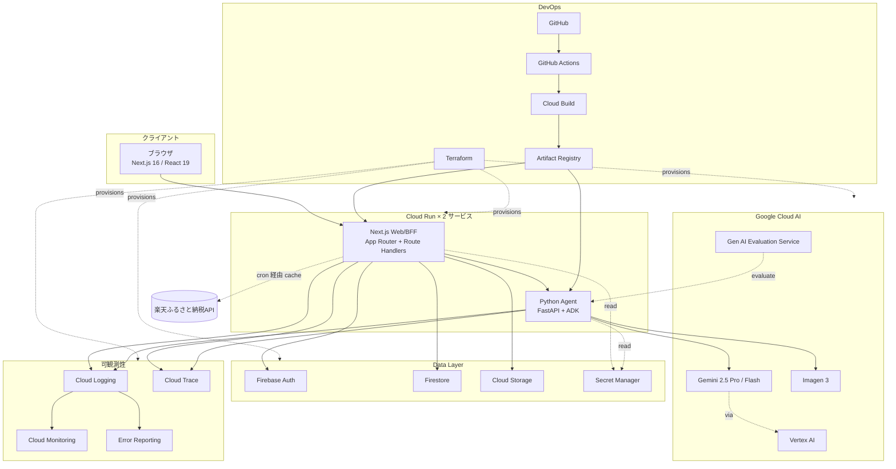
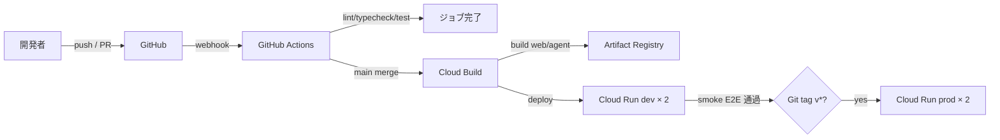
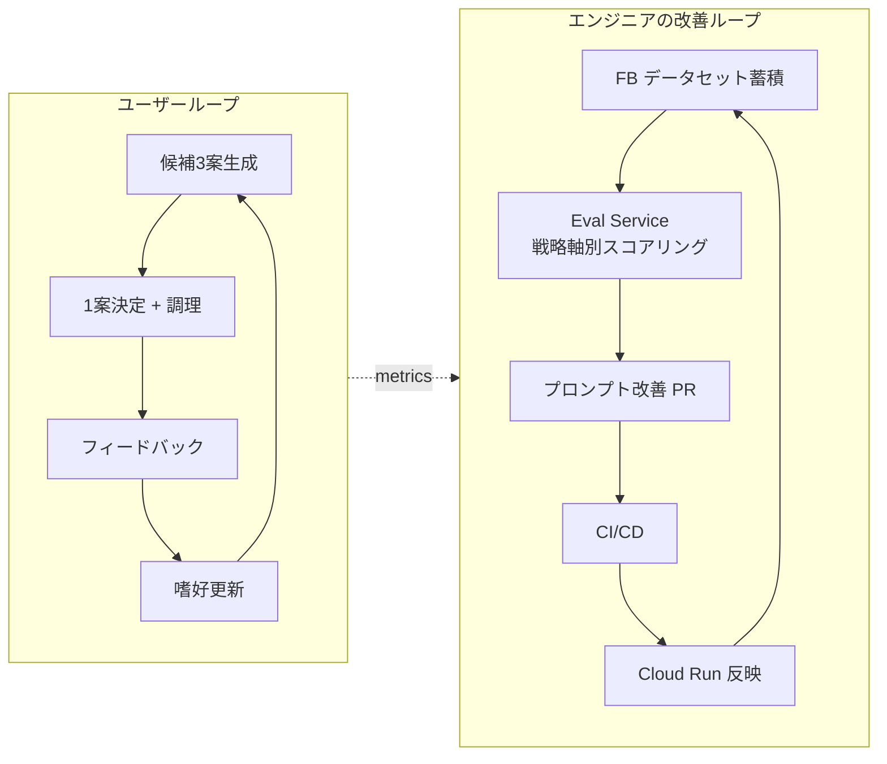

# 技術仕様書(Architecture)

> 本書は **ふるさとピザ帳** (技術名: MakeLocalPizzaRecipeAgent) の技術スタック、開発ツール、技術制約、パフォーマンス要件を定義する。
> プロダクト要求は [product-requirements.md](product-requirements.md)、機能設計は [functional-design.md](functional-design.md)、ハッカソン制約は [hackathon-reference.md](hackathon-reference.md) を参照。

---

## 1. 技術選定の方針

### 1.1 選定原則

1. **ハッカソン必須要件を満たす** — Google Cloud 実行プロダクト(Cloud Run) + Google Cloud AI(Gemini / Vertex AI / ADK)を中核
2. **「つくる・まわす・とどける」を実装で示せる構成** — CI/CD・IaC・可観測性・継続的評価を最初から組み込む
3. **個人開発で締切までに完成できる** — 既知技術の組合せを優先、新規学習は最小限
4. **エージェントの自律性を技術選定で担保** — ADK / Function Calling を採用し、ツール選択ロジックをコードに書かない
5. **ポリグロット分離は責務単位で** — Web/BFF は Next.js (TS)、Agent は Python (ADK)。境界は HTTP + IAM
6. **デザインハンドオフとの整合** — `design/` の React/CSS 変数を本実装に流用、和モダンの単一テーマで統一

### 1.2 採用 / 不採用の判断基準

| 判断軸 | 採用条件 |
| --- | --- |
| Google Cloud 必須要件 | 必ず含める |
| DevOps 評価軸への寄与 | 直接的に審査評価につながるなら採用 |
| 学習コスト | Boot Camp + 公式 Quickstart で 1 週間以内に習得可能 |
| 個人負担コスト | 月 1 万円以内に収まる |
| 締切までの実装可能性 | 2026/6 月末までに本番投入できる |

---

## 2. テクノロジースタック

### 2.1 全体図

[functional-design.md §1.1](functional-design.md#11-構成図) のシステム構成図を参照。本書ではレイヤ別技術一覧を記載。



### 2.2 レイヤ別技術一覧

#### 2.2.1 フロントエンド (Web)

| 項目 | 採用技術 | 補足 |
| --- | --- | --- |
| フレームワーク | **Next.js 16 (App Router)** | RSC + Server Actions + Route Handlers |
| UI ライブラリ | **React 19** | デザインプロトタイプも React ベース |
| 言語 | **TypeScript 5.x** | strict, noUncheckedIndexedAccess |
| スタイル | **CSS Modules + CSS 変数** | `design/pizza-tokens.jsx` の `T` をベースに移植 |
| 状態管理 | **Zustand** | RSC と相性良、軽量 |
| バリデーション | **Zod** | API 入出力スキーマと共有 |
| ストリーム受信 | **Fetch ReadableStream + NDJSON** | 候補生成・詳細生成の段階的レンダリング |
| アイコン | **lucide-react** | ライセンス・サイズ |
| フォント | Shippori Mincho B1 / Zen Kaku Gothic New / JetBrains Mono | `next/font/google` でセルフホスト最適化 |

#### 2.2.2 BFF (Web 同居)

| 項目 | 採用技術 | 補足 |
| --- | --- | --- |
| ランタイム | **Node.js 22 LTS** | Cloud Run 公式サポート |
| フレームワーク | **Next.js Route Handlers** | 独立サーバーは作らない |
| 認証 | **Firebase Authentication** (Google ログイン) | ID トークン検証は `firebase-admin` |
| Firestore SDK | **firebase-admin** | サーバー側 |
| ロギング | 構造化 JSON + Cloud Logging | |
| トレース | **@opentelemetry/sdk-node** + Cloud Trace Exporter | エージェント呼び出しを Span 化 |
| Agent 呼び出し | **HTTPS + IAM (Cloud Run service-to-service)** | google-auth-library で ID トークン取得 |

#### 2.2.3 AI Agent レイヤ

| 項目 | 採用技術 | 補足 |
| --- | --- | --- |
| 言語 | **Python 3.12+** | ADK / Pydantic の親和性 |
| エージェントフレームワーク | **google-adk** | ハッカソン必須技術リストに明記 |
| Web フレームワーク | **FastAPI + Uvicorn** | ストリーミング(NDJSON) 出力 |
| LLM | **Gemini 2.5 Pro**(候補生成・推論) + **Gemini 2.5 Flash**(軽量タスク = T5 等) | Vertex AI 経由 |
| マルチモーダル画像生成 | **Imagen 3** | 詳細画面遷移時のみ生成(コスト制御) |
| エージェント評価 | **Vertex AI Gen AI Evaluation Service** | 戦略軸ごとの品質を計測 |
| パッケージ管理 | **uv** | 高速、再現性 |
| Embedding(v2) | text-embedding-004 | 過去 FB の類似検索、MVP では未使用 |

#### 2.2.4 データ層

| 項目 | 採用技術 | 補足 |
| --- | --- | --- |
| 認証 | **Firebase Authentication** | Google ログインのみ。任意(無認証でも Quick Tap 完結) |
| OLTP DB | **Firestore (Native mode)** | サブコレクション、ユーザー単位隔離 |
| 端末ローカル | **localStorage** | 地元選択、食材履歴、匿名セッション ID |
| オブジェクトストレージ | **Cloud Storage** | レシピ画像、FB 写真。バケット 1 つ + プレフィックス分割 |
| キャッシュ | **Firestore `furusato_cache/*`** | TTL 7 日、楽天 API のキャッシュ |
| Secret 管理 | **Secret Manager** | API キー、Firebase Admin 鍵 |

#### 2.2.5 インフラ・実行環境

| 項目 | 採用技術 | 補足 |
| --- | --- | --- |
| コンピュート | **Cloud Run × 2 サービス** | `mlpr-web`(Next.js) と `mlpr-agent`(Python)。「とどける」に直接対応 |
| サービス間通信 | Cloud Run 内部 HTTPS + IAM(Cloud Run Invoker) | 公開エンドポイントは `mlpr-web` のみ |
| コンテナレジストリ | **Artifact Registry** | 2 リポジトリ(web / agent) |
| ビルド | **Cloud Build** + Dockerfile | GitHub 連携 |
| IaC | **Terraform 1.10+** | 状態は GCS バックエンド |
| リージョン | **asia-northeast1 (東京)** | Imagen 3 が未対応の場合のみ画像生成は us-central1 |

#### 2.2.6 DevOps・可観測性

| 項目 | 採用技術 | 補足 |
| --- | --- | --- |
| バージョン管理 | **GitHub** | 公開リポジトリ(提出要件) |
| CI/CD | **GitHub Actions** + **Cloud Build** | テスト → ビルド → デプロイ |
| ロギング | **Cloud Logging** | 構造化ログ、ログベースメトリクス |
| メトリクス | **Cloud Monitoring** | レイテンシ・エラー率・Gemini トークン消費・**戦略軸別品質スコア** |
| トレース | **Cloud Trace** + OpenTelemetry | TS / Python 両方から送信 |
| エラー追跡 | **Error Reporting** | 自動アラート |
| ダッシュボード | **Cloud Monitoring Dashboards** | 審査用スクリーンショットを意識 |
| 通知 | Cloud Monitoring Alerting → Slack | 5xx 上昇・p95 倍超など |

#### 2.2.7 開発ツール

| 項目 | 採用技術 | 補足 |
| --- | --- | --- |
| Node パッケージ管理 | **pnpm 10+** | 高速・ディスク効率 |
| Python パッケージ管理 | **uv** | 高速、`pyproject.toml` + `uv.lock` |
| Lint (TS) | ESLint(Next.js Strict + @typescript-eslint) | CI 必須 |
| Lint (Py) | **ruff** | フォーマッタも兼ねる |
| 型チェック (TS) | `tsc --noEmit` | CI 必須 |
| 型チェック (Py) | **mypy** | 主要モジュールのみ |
| ユニットテスト (TS) | **Vitest** | RSC 相性良 |
| ユニットテスト (Py) | **pytest + pytest-asyncio** | |
| E2E | **Playwright** | スモークのみ |
| Git Hook | **lefthook** | pre-commit に lint/format/typecheck/gitleaks |
| AI 開発支援 | Claude Code | 個人開発の生産性 |

### 2.3 ふるさと納税連動レイヤ(3層分離)

[functional-design.md §10](functional-design.md#10-楽天ふるさと納税連動レイヤ) を参照。実装層構成:

| 層 | 責務 | 実装 |
|---|---|---|
| Curated YAML | 地場食材ナレッジベース | `agent/data/ingredients.yaml` → build 時に JSON 生成 |
| Refresh script | 楽天 API を 1 req/秒で叩く唯一の発行源 | `agent/scripts/refresh_furusato_cache.py` (cron) |
| Firestore キャッシュ | TTL 7 日 | `furusato_cache/{ingredientKey}` |
| Agent ランタイム | キャッシュ参照のみ | `agent/src/makelocal_agent/furusato/tool.py` |
| UI | レシピに紐づく取り寄せ候補表示 | `src/components/recipe/FurusatoSection.tsx` |

`FURUSATO_INTEGRATION` env で on/off。既定 off で safe rollout。

---

## 3. リポジトリ構成(概要)

詳細は [repository-structure.md](repository-structure.md)。本書では大枠のみ。

```
.
├── app/                            # Next.js App Router (Web/BFF)
├── src/                            # TS 共通ロジック、コンポーネント、agent クライアント
├── agent/                          # Python ADK Agent (独立サービス)
│   ├── src/makelocal_agent/
│   ├── data/                       # ingredients.yaml
│   └── scripts/                    # refresh_furusato_cache.py 等
├── design/                         # デザインハンドオフ(参照用)
├── docs/                           # 永続的ドキュメント
├── infra/
│   ├── terraform/
│   └── cloudbuild/
├── .github/workflows/
└── tests/                          # E2E
```

---

## 4. 環境構成

### 4.1 環境一覧

| 環境 | 用途 | デプロイトリガー | 備考 |
| --- | --- | --- | --- |
| local | 開発者ローカル | — | Firestore Emulator + モック Agent + モック楽天API |
| dev | 動作確認・統合 | `main` ブランチへの push | Cloud Run(最小 0) |
| prod | 本番(ハッカソン提出) | `main` の `v*` タグ | Cloud Run(最小 0、最大 5) |

→ 個人開発・コスト管理の観点から **dev / prod の 2 環境のみ**。

### 4.2 環境変数(主要)

すべて Secret Manager 管理。Cloud Run 起動時にサービスアカウント経由で読み込み。

| 変数名 | 用途 | 配置 |
| --- | --- | --- |
| `GOOGLE_CLOUD_PROJECT` | プロジェクト ID | web, agent |
| `VERTEX_AI_LOCATION` | Vertex AI リージョン | agent |
| `IMAGEN_LOCATION` | Imagen リージョン(東京 or us-central1) | agent |
| `FIREBASE_PROJECT_ID` / `FIREBASE_CLIENT_EMAIL` / `FIREBASE_PRIVATE_KEY` | Firebase Admin | web |
| `NEXT_PUBLIC_FIREBASE_*` | フロント用 Firebase Config | web (public) |
| `RAKUTEN_APPLICATION_ID` / `RAKUTEN_ACCESS_KEY` | 楽天 Web Service | agent(refresh script のみ) |
| `AGENT_SERVICE_URL` | mlpr-agent の Cloud Run URL | web |
| `FURUSATO_INTEGRATION` | feature flag(`on`/`off`) | web, agent |

### 4.3 リージョン

- メイン: **asia-northeast1 (東京)**
- 例外: Imagen 3 が東京未対応の場合のみ画像生成は **us-central1**

---

## 5. CI/CD パイプライン

### 5.1 全体フロー



### 5.2 GitHub Actions のジョブ

1. **CI(PR・push)**:
   - Node: `pnpm install --frozen-lockfile` → lint → typecheck → vitest → build
   - Python: `uv sync` → ruff → mypy → pytest
   - 並列実行、すべて通れば merge 可
2. **Deploy to dev(main merge)**:
   - Cloud Build 起動 → Docker(web, agent)ビルド → 両 Cloud Run dev デプロイ
   - Playwright スモーク(`/api/health`, Tap1→Tap2→候補生成のハッピーパス)
3. **Deploy to prod(`v*` タグ)**:
   - 既存イメージを Cloud Run prod へプロモート

### 5.3 IaC 運用

- すべての GCP リソースは Terraform で定義
- `terraform plan` を PR で実行、差分を PR コメントに表示
- `terraform apply` は手動承認(コスト発生リソースのため)

---

## 6. パフォーマンス要件

### 6.1 ユーザー体験指標

PRD §4.2.1 と整合。

| 指標 | 目標 | 測定方法 |
| --- | --- | --- |
| 初回画面表示(LCP) | 2.5 秒以内(モバイル 4G) | Lighthouse |
| Tap2 完了 → 候補3案の体感到達 | 30 秒以内(ストリーム含む) | Cloud Trace |
| 候補1案決定 → 詳細レシピ完成(画像含む) | 30 秒以内 | Cloud Trace |
| 候補画面の最初のカードのタイトル表示 | 5 秒以内 | フロント計測 |
| エラー率 | 1% 未満(5xx) | Cloud Monitoring |

### 6.2 スケーラビリティ

- Cloud Run web/agent: 最小 0 / 最大 5 インスタンス
- 同時接続: 1 インスタンスあたり 80 リクエスト(web) / 20 リクエスト(agent、Gemini I/O 律速)
- 想定最大同時ユーザー: 50(審査時ピーク)

### 6.3 コスト想定(個人負担)

| サービス | 月額目安(MVP) |
| --- | --- |
| Cloud Run × 2 | 0〜800 円 |
| Firestore | 0〜500 円(無料枠内想定) |
| Cloud Storage | 0〜200 円 |
| Gemini API(候補3案 + 学習トレイト + 評価) | 1,500〜4,000 円 |
| Imagen 3(詳細遷移時のみ) | 500〜2,000 円 |
| Cloud Logging / Monitoring / Trace | 無料枠内 |
| **合計目安** | **2,500〜7,500 円/月** |

→ Google Cloud クレジット(ハッカソン配布があれば)を活用。

---

## 7. 技術的制約

### 7.1 ハッカソン由来の必須制約

- **公開 GitHub リポジトリ**: シークレットを絶対に含めない
- **動作確認できるデプロイ URL**: 提出時点で安定稼働
- **必須技術**: Cloud Run(実行) + Gemini / Vertex AI / ADK(AI) — 本書 §2 で満たしている
- **個人参加**: 個人 Google Cloud アカウントで運用

### 7.2 自己制約

- スコープを増やしたくなっても **6 月末までに DevOps 一式が完成すること** を最優先
- 認証は Google ログインのみ(任意)、メアド+パスワードは実装しない
- ピザ以外の料理フォーマットは v2(スコープ拡大は誘惑だが避ける)

---

## 8. セキュリティ要件

### 8.1 シークレット管理

- すべての API キー・サービスアカウント鍵は **Secret Manager**
- `.env` は Git 管理外、`.env.example` のみ公開
- GitHub Actions は Workload Identity Federation(鍵レス)で Cloud Build を起動

### 8.2 認証・認可

- Firebase Authentication で Google ログイン(任意)
- 認証必須エンドポイント(`/api/recipes`, `/api/recipes/{id}/feedback` 等)は Firebase ID Token を `Authorization: Bearer` で検証
- Firestore は `users/{uid}/**` でユーザー単位隔離
- Cloud Run mlpr-agent は IAM Cloud Run Invoker ロールを持つ mlpr-web サービスアカウントからのみ呼び出し可能

### 8.3 入出力検証

- すべての API 入力は Zod(TS)/ Pydantic(Python)で検証
- Gemini への入力(コメント等の自由入力)は事前にサニタイズ
- 地元・食材選択はホワイトリスト方式(ID 一致のみ受理)
- フロントへの出力は React のデフォルトエスケープに依存

### 8.4 ログ取り扱い

- 個人を特定できる情報(メアド・本文)は構造化ログから除外
- ユーザー UID は記録するが、ログ閲覧者は IAM で制限
- Gemini への入力プロンプトは「タスク特定可能な範囲」のみログ

---

## 9. 可観測性の設計

### 9.1 ログ設計

- 構造化 JSON ログ
- 必須フィールド: `timestamp`, `severity`, `requestId`, `userId`(認証時) / `guestSessionId`(無認証時), `sessionId`, `event`, `latencyMs`
- 戦略軸別フィールド: `strategy`(`exploit` / `tune` / `explore`)を候補生成ログに含める

### 9.2 トレース設計

重要 Span:

- `http.request` — Web リクエスト全体
- `agent.candidates.generate` — 候補3案生成全体
- `agent.candidate.{strategy}` — 戦略軸ごとの生成
- `agent.tool.{toolId}` — 各ツール実行
- `agent.detail.generate` — 詳細レシピ生成
- `gemini.generate` — Gemini 呼び出し
- `imagen.generate` — Imagen 呼び出し
- `firestore.{op}` — DB アクセス
- `rakuten.cache.read` — 楽天キャッシュ参照

### 9.3 ダッシュボード(Cloud Monitoring)

審査時のスクリーンショット用途を想定:

1. **サービス健全性**: リクエスト数、レイテンシ、エラー率(web / agent それぞれ)
2. **エージェント挙動**: ツール選択分布、平均ツール実行回数、候補生成成功率
3. **戦略軸別品質**: Exploit / Tune / Explore のスコア推移(Vertex AI Gen AI Evaluation 由来)
4. **コスト**: Gemini トークン消費、Imagen 生成回数、楽天 API リフレッシュ回数

### 9.4 アラート

- 5xx エラー率 5% 超過で通知
- レイテンシ p95 が目標の 2 倍を超過で通知
- 楽天 API キャッシュ更新失敗が連続 3 回で通知

---

## 10. 「まわす」の継続的改善ループ

ハッカソン中核アピール。プロダクトのフィードバックループ([functional-design.md §7](functional-design.md#7-フィードバックループの設計))とエンジニア側の品質改善ループの2層構成。



エンジニア側ループ:

- フィードバックを評価データセットとして Vertex AI Gen AI Evaluation Service に流す
- Exploit / Tune / Explore の戦略軸ごとに別々にスコアリング
- スコアダウン時はプロンプト改善 PR を作成、CI/CD で自動デプロイ
- ダッシュボードでスコア推移を可視化 → 審査用スクリーンショット

---

## 11. 受け入れ判定基準(技術観点)

### 11.1 デプロイ要件
- [ ] Cloud Run mlpr-web で公開 URL が稼働
- [ ] Cloud Run mlpr-agent が IAM 越しに mlpr-web から呼び出し可能
- [ ] HTTPS 必須(Cloud Run マネージドで自動)
- [ ] 公開 GitHub リポジトリにソースが公開されている
- [ ] README にセットアップ・アーキテクチャ概要が記載されている

### 11.2 DevOps 要件
- [ ] Terraform で全インフラが定義されている
- [ ] GitHub Actions で CI/CD が稼働(Node + Python 両方)
- [ ] Cloud Logging / Monitoring / Trace が機能している
- [ ] エージェント評価ループ(Eval Service 等)が動作している
- [ ] 戦略軸別の品質スコアがダッシュボードで確認できる

### 11.3 セキュリティ要件
- [ ] シークレットがリポジトリに含まれていない(gitleaks 通過)
- [ ] Secret Manager から正常に読み込めている
- [ ] Firestore がユーザー単位で隔離されている
- [ ] mlpr-agent が公開 URL を持たない(IAM 限定)

### 11.4 性能要件
- [ ] §6.1 のすべての性能目標を満たしている
- [ ] 同時 50 ユーザーに耐える(負荷試験で確認)

---

## 12. 改訂履歴

| 日付 | 版 | 変更内容 |
| --- | --- | --- |
| 2026-05-13 | 1.0 | 初版作成(MakeLocalPizzaRecipeAgent のリフレッシュ仕様に基づく)。Web/BFF (Next.js) と Agent (Python ADK) を Cloud Run 2 サービスとして明示的に分離。戦略軸別の評価ループ、楽天 API 3層分離、無認証 Quick Tap、Imagen の詳細遷移時のみ生成を要件化。 |
| 2026-05-24 | 1.1 | サービス名を「ふるさとピザ帳」に確定 (Slice 7、FR-7-8)。表向きの表記はヘッダ更新のみ。技術スタック・リソース命名は変更なし (mlpr-\* prefix 維持)。 |
