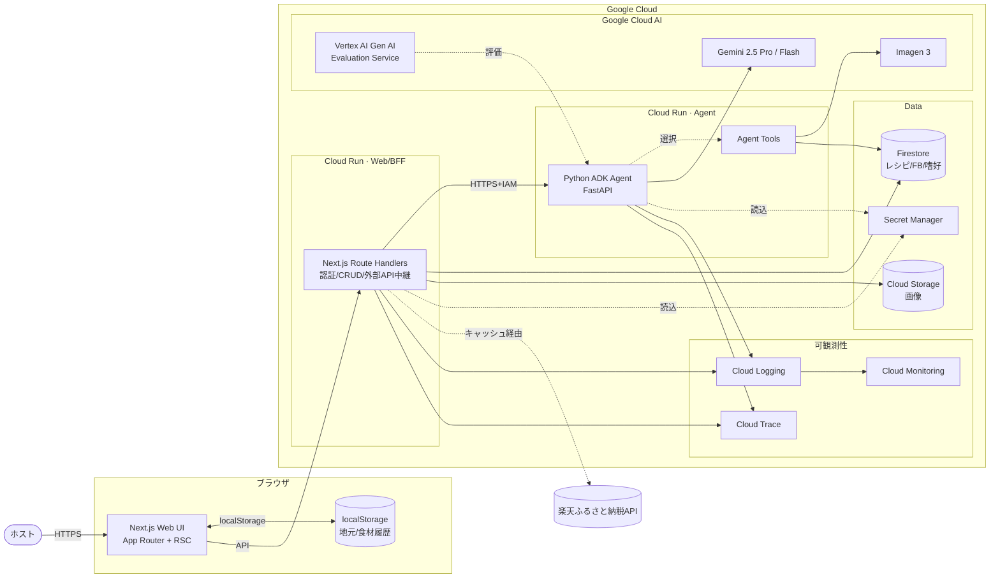
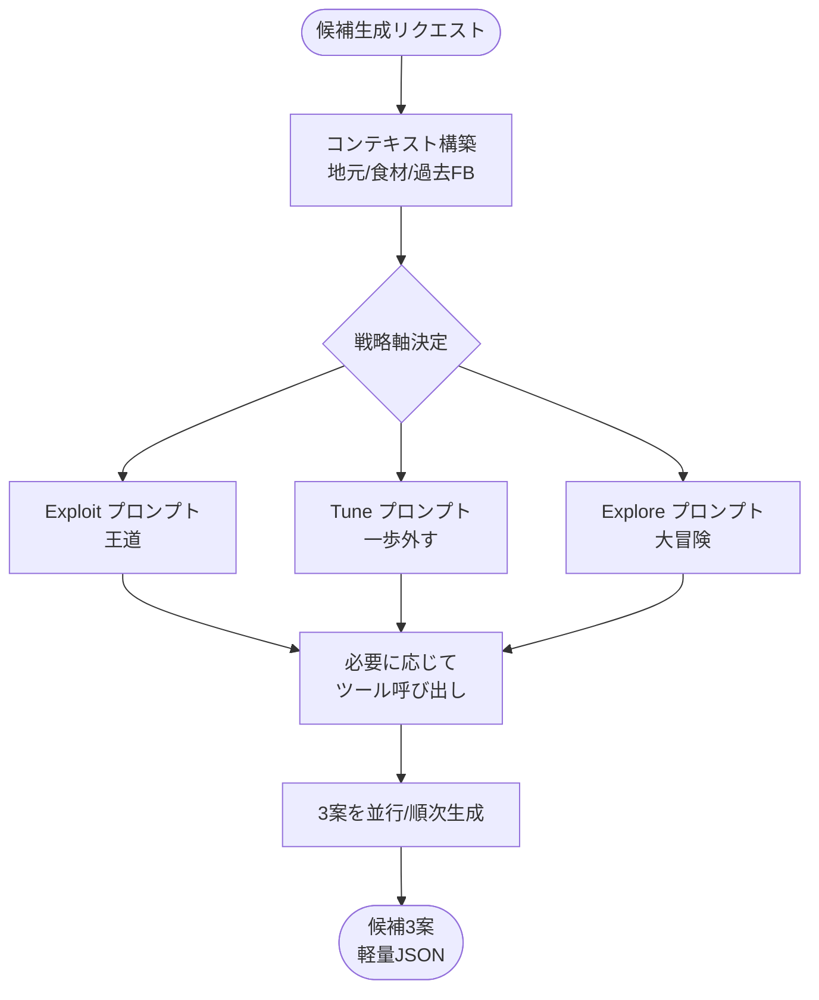
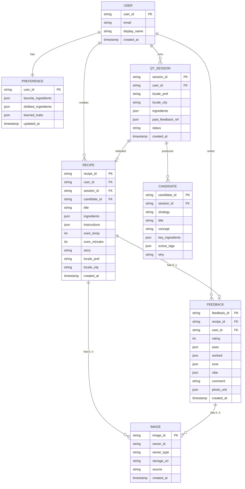
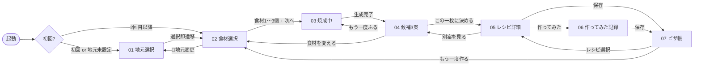
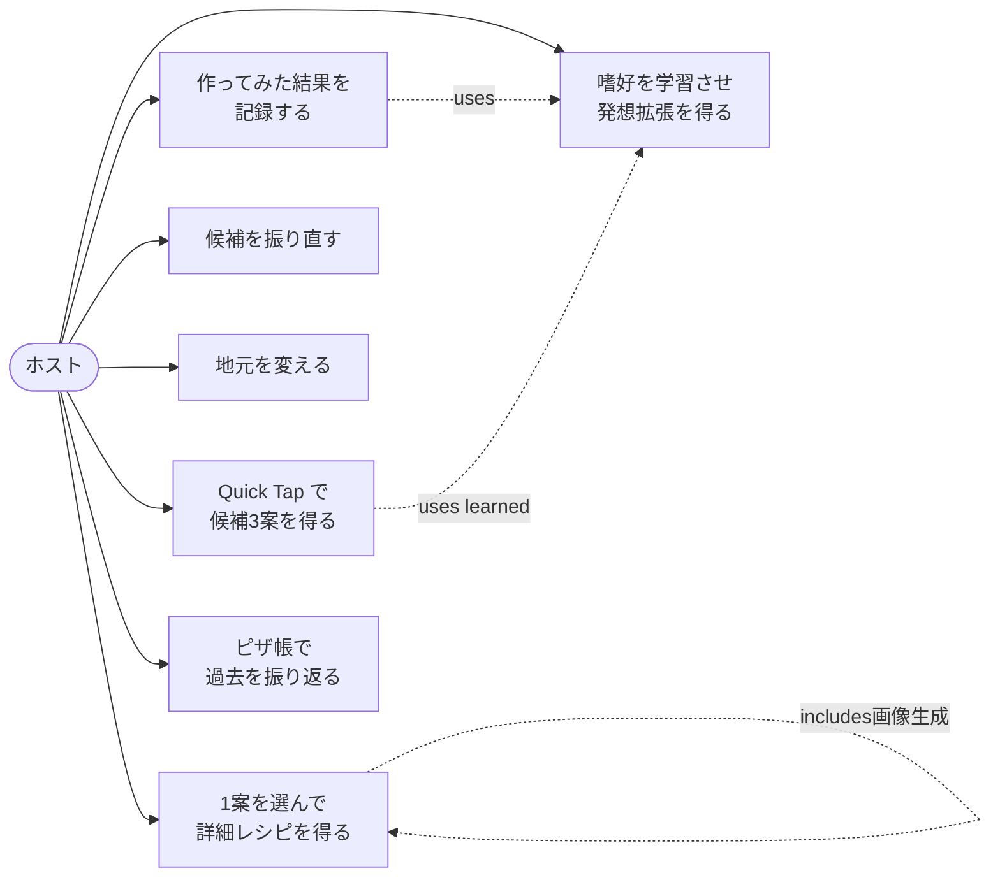
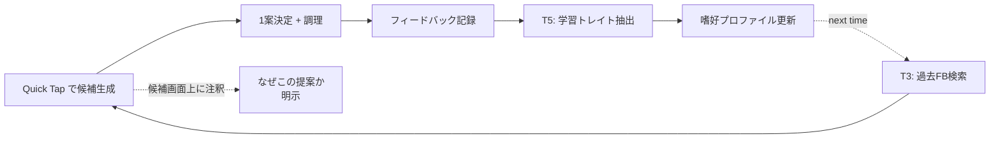
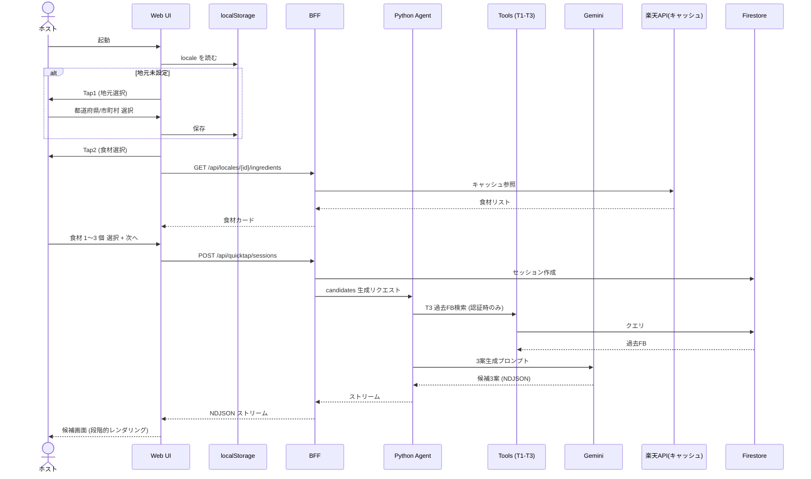
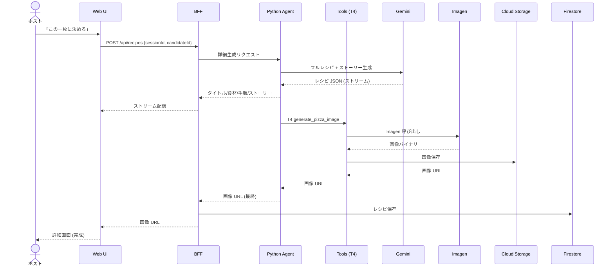
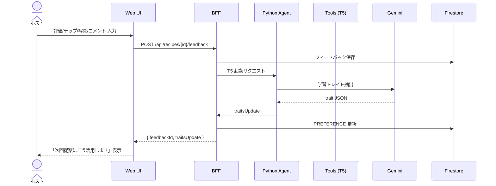

# 機能設計書(Functional Design Document)

> 本書は **ふるさとピザ帳** (技術名: MakeLocalPizzaRecipeAgent) の永続的な機能設計を定義する。
> プロダクト要求は [product-requirements.md](product-requirements.md)、技術スタックは [architecture.md](architecture.md) を参照。
> UI のビジュアル仕様・画面プロトタイプは [`/design/MakeLocalPizzaRecipe.html`](../design/MakeLocalPizzaRecipe.html)(静的キャンバス・7画面) および [`/design/MakeLocalPizzaRecipe Prototype.html`](../design/MakeLocalPizzaRecipe%20Prototype.html)(動くプロトタイプ) を参照。

---

## 1. システム全体構成

### 1.1 構成図



### 1.2 構成要素の責務

| 要素 | 責務 |
| --- | --- |
| **Next.js Web UI** | Quick Tap 動線(地元 → 食材 → 候補3案 → 詳細)、フィードバック入力、ピザ帳。**地元選択は localStorage** |
| **Next.js BFF** | 認証検証、Firestore/Storage CRUD、楽天 API キャッシュ管理、Agent 呼び出しの中継 |
| **Python ADK Agent** | Quick Tap セッションのオーケストレーション、候補3案の並行生成、Exploit/Tune/Explore のプロンプト戦略、ツール選択 |
| **Agent Tools** | 食材検索 / 季節判定 / 過去 FB 検索 / 画像生成。1ツール1責務 |
| **Firestore** | レシピ・フィードバック・嗜好プロファイル・ふるさと納税キャッシュの永続化 |
| **Cloud Storage** | Imagen 生成画像、ユーザーアップロード写真 |
| **楽天ふるさと納税API** | 地元食材カタログのデータソース(外部) |
| **可観測性スタック** | Cloud Logging/Monitoring/Trace。ETE 戦略軸ごとの品質指標も収集 |

### 1.3 BFF と Agent の境界

旧 `MakePizzaRecipeAgent` で確立された設計を踏襲:

- **BFF (Next.js / TypeScript)**: HTTPS 境界・認証・データアクセス・コスト管理(レート制限)
- **Agent (Python / ADK)**: LLM オーケストレーション・ツール呼び出し・プロンプト戦略
- **通信**: BFF → Agent は内部 HTTP(IAM 認証)。Agent → BFF への能動的呼び出しは行わない(Agent は副作用なしの計算層に近い)

---

## 2. AI エージェント設計

### 2.1 エージェントアーキテクチャ

ADK(Agents Development Kit / Python) で構築し、Gemini をコアモデルとする。Quick Tap 体験では**多段対話を持たず、Tap2 完了で1回呼び出されて候補3案を生成**する。



### 2.2 ツール一覧

| ツール ID | 名称 | 入力 | 出力 | 実装方針 |
| --- | --- | --- | --- | --- |
| T1 | `search_local_ingredients` | 地元(都道府県/市町村), 季節 | 食材リスト + 産地・由来 | 楽天ふるさと納税API(BFF 経由のキャッシュ)を主、Gemini 知識ベースをフォールバック |
| T2 | `get_seasonal_context` | 月 or 日付 | 旬の食材・行事・雰囲気 | Gemini 知識ベース |
| T3 | `retrieve_user_feedback` | ユーザー ID, 食材, n 件 | 過去レシピ + 評価 + 注釈 | Firestore クエリ(MVP)、v2 で Embedding 類似検索 |
| T4 | `generate_pizza_image` | レシピ JSON | 画像 URL | Imagen 呼び出し → Cloud Storage 保存。**詳細画面遷移時のみ**呼ばれる |
| T5 | `extract_learned_traits` | フィードバック JSON | 学習トレイト配列 | Gemini プロンプトで実装、フィードバック保存時に発火 |

### 2.3 ツール選択の自律性(ハッカソン評価軸①)

- **ハードコード禁止**: 「if 食材入力 then T1 を呼ぶ」のような決め打ちロジックは実装しない
- ADK のツール `description` を丁寧に整備し、**Gemini が状況に応じて自律選択**する
- ツール選択は OpenTelemetry Span として記録 → Cloud Trace で監査可能

### 2.4 Quick Tap セッション状態

```python
class QuickTapSession:
    session_id: str
    user_id: str | None       # 認証済みなら Firebase UID、なければ None
    locale: Locale            # 都道府県 + 市町村
    ingredients: list[str]    # 食材 ID 1〜3個
    past_feedback: list[FeedbackSummary] | None
    candidates: list[Candidate]   # 3案(軽量)
    selected_candidate_id: str | None
    detail_recipe: Recipe | None  # Tap3 後に詳細生成された場合のみ
    created_at: datetime
```

### 2.5 Exploit / Tune / Explore プロンプト戦略

エージェントは Gemini に**3案を異なる戦略軸で並行生成**するよう指示する。プロンプトは以下の構造:

```
# 共通コンテキスト
- 地元: {locale.prefecture} / {locale.city}
- 食材: {ingredients}
- 季節: {current_season}
- 過去フィードバック: {past_feedback_summary}  # 0件時は省略

# 戦略指示
3案を以下の3つの軸で生成すること。各案は明確に異なる方向性を持つこと。
1. Exploit (王道): 過去 high-rating 傾向に沿った堅実案
2. Tune (一歩外す): WHAT TO TUNE で繰り返し挙がる軸を改善した案
3. Explore (大冒険): 過去履歴と類似度の低い、新しい方向への挑戦案

# 出力スキーマ (JSON)
{ candidates: [{ strategy, title, concept, key_ingredients, scene_tags, why }, ...] }
```

戦略軸ごとの具体的な食材選定・調理アプローチは Gemini に委ねる(評価軸①の必然性)。

### 2.6 過去フィードバック蓄積量による出し分け

PRD §3.3.3 / AC-4 と整合:

| 蓄積件数 | 戦略 |
| --- | --- |
| 0件 | Explore 軸を主軸に多様性提示(王道+攻め+意外性) |
| 1〜4件 | Exploit/Tune/Explore 軽量適用、UI で「もっと記録すると精度が上がります」表示 |
| 5件以上 | フル適用、関連過去レシピも候補画面に表示 |

---

## 3. データモデル

### 3.1 ER 図



### 3.2 Firestore コレクション設計

| コレクション | ドキュメント ID | 用途 |
| --- | --- | --- |
| `users/{userId}` | Firebase Auth UID | ユーザー情報 |
| `users/{userId}/preferences/profile` | 固定 `profile` | 嗜好プロファイル(自動更新) |
| `users/{userId}/sessions/{sessionId}` | 自動生成 | Quick Tap セッション(候補3案を含む) |
| `users/{userId}/recipes/{recipeId}` | 自動生成 | 確定レシピ |
| `users/{userId}/recipes/{recipeId}/feedback/{feedbackId}` | 自動生成 | フィードバック |
| `furusato_cache/{ingredientKey}` | 食材ID | 楽天ふるさと納税のキャッシュ(全ユーザー共通、TTL 7 日) |

### 3.3 Cloud Storage バケット設計

- `gs://{project}-images/users/{userId}/recipes/{recipeId}/generated/{imageId}.png` — Imagen 生成画像
- `gs://{project}-images/users/{userId}/feedback/{feedbackId}/{n}.jpg` — ユーザー写真(最大4枚)

### 3.4 端末ローカル(localStorage) 設計

PRD §5.4 と整合。**認証なしでも Quick Tap が完結**するために最小限のキーを保持:

| キー | 内容 | TTL |
| --- | --- | --- |
| `mlpr.locale.v1` | `{ prefecture, city, selectedAt }` | 永続(明示変更まで) |
| `mlpr.recentIngredients.v1` | 直近選択した食材 ID 配列(最大 20) | 永続 |
| `mlpr.guestSessionId.v1` | 認証なし時の匿名セッション識別子 | 永続(認証後はクラウド側 user_id に紐付け) |

---

## 4. 画面構成・遷移

### 4.1 主要画面一覧

設計プロトタイプ([design/MakeLocalPizzaRecipe.html](../design/MakeLocalPizzaRecipe.html)) との対応:

| 画面 ID | 画面名 | 用途 | デザイン参照 |
| --- | --- | --- | --- |
| 01 | 地元選択 | Tap1。47都道府県を地域別表示、選択即遷移 | `LocalScreen` |
| 02 | 食材選択 | Tap2。季節/カテゴリタブ、食材カード、`📍地元名▾`で地元変更 | `IngredientsScreen` |
| 03 | 焼成中 | ローディング演出(ピザが焼ける) | `LoadingScreen` |
| 04 | 候補3案 | Tap3画面。縦スクロール、3案を眺める、関連過去レシピ、振り直しボタン | `CandidatesScreen` |
| 05 | レシピ詳細 | フルレシピ + ストーリー + Imagen 画像。戦略印(右上)、保存/作ってみた動線 | `DetailScreen` |
| 06 | 作ってみた記録 | フィードバック入力。観点別+3種チップ+写真最大4枚+コメント280字 | `FeedbackScreen` |
| 07 | ピザ帳 | 保存レシピ + FB の一覧。「もう一度作る」導線 | `SavedScreen` |

### 4.2 画面遷移図



### 4.3 デザインシステム概要

正式仕様は [`design/`](../design/) を参照。本書では概要のみ。

- **配色**: 和紙 `#F2E9D6` / 生成り `#FBF7ED` / 墨 `#1F1A12` / 朱 `#C8412A` / 山吹 `#DC8A2A` / 抹茶 `#607744` / 藍 `#3E5670`
- **タイポグラフィ**: 見出し **Shippori Mincho B1** / 本文 **Zen Kaku Gothic New** / Mono **JetBrains Mono**
- **モチーフ**: 和紙ノイズテクスチャ、縦組み明朝の小キャプション、朱の小印(戦略印)
- **戦略印の色**: Exploit=朱深 `#9F3220` / Tune=山吹深 `#8A5A1F` / Explore=藍 `#3E5670`
- **デバイス**: モバイルファースト(393×852 を基準幅)、デスクトップでは中央寄せ表示

### 4.4 戦略軸の UI 表現

候補3案カード上には**戦略印(StrategySeal)** が常時表示され、Exploit/Tune/Explore が一目で識別できる。日本語意訳:

| 戦略 | 日本語ラベル | 色 |
| --- | --- | --- |
| Exploit | 王道 | 朱 |
| Tune | 一歩外す | 山吹 |
| Explore | 大冒険 | 藍 |

各カードには **「なぜこの提案か」注釈**(過去 FB の活用根拠) が小書きで添えられる(透明性)。

---

## 5. ユースケース

### 5.1 ユースケース図



### 5.2 主要ユースケースの詳細

#### UC1: Quick Tap で候補3案を得る (初回 + リピート)

- **アクター**: ホスト
- **事前条件**: 認証不要(地元未設定の初回は Tap1 から、設定済みは Tap2 から)
- **基本フロー**:
  1. アプリ起動 → localStorage の `mlpr.locale.v1` を確認
  2. (初回) 地元選択画面で都道府県・市町村を選択 → localStorage 保存 → Tap2 へ
  3. (リピート) 直接 Tap2 食材選択画面へ
  4. 食材を 1〜3 個選択 → 「次へ」
  5. 焼成中画面表示中に裏で Agent が候補3案を生成
  6. 候補画面で 3 案を縦スクロールで眺める
- **代替フロー**:
  - 4a. 「📍地元変更」 → Tap1 に戻る
  - 6a. 「もう一度ふる」 → 同じ食材で再生成
  - 6b. 「食材を変える」 → Tap2 に戻る
- **完了条件**: ユーザーが候補3案を眺められる状態に到達

#### UC5: 作ってみた結果を記録する

- **アクター**: ホスト(認証済み)
- **事前条件**: 対象レシピが保存済み
- **フロー**:
  1. レシピ詳細から「作ってみた」を選択
  2. 総合評価(★1〜5)・観点別評価・3種チップ(WHAT WORKED / WHAT TO TUNE / GUEST VIBE)を入力
  3. 写真(最大4枚)・コメント(280字)を入力(任意)
  4. 保存
  5. システムは Agent の T5 ツールで学習トレイトを抽出し、嗜好プロファイルを更新
  6. UI 上で「次回提案にこう活用します」の予告メッセージを表示(透明性)
- **完了条件**: フィードバックが Firestore に保存、嗜好プロファイルが更新

---

## 6. API 設計(BFF)

Next.js Route Handlers として実装。認証は Firebase Auth ID トークンを `Authorization: Bearer` で受け取る(任意)。

### 6.1 エンドポイント一覧

| Method | Path | 用途 | リクエスト | レスポンス | 認証 |
| --- | --- | --- | --- | --- | --- |
| GET | `/api/health` | ヘルスチェック | — | `{ ok: true }` | 不要 |
| GET | `/api/locales` | 地元一覧 | `?q=keyword` | `Locale[]` | 不要 |
| GET | `/api/locales/{id}/ingredients` | 地元食材一覧 | `?season=spring&category=vegetable` | `Ingredient[]` | 不要 |
| POST | `/api/quicktap/sessions` | 候補3案生成 | `{ localeId, ingredients[], guestSessionId? }` | `{ sessionId, candidates[] }` (SSE/NDJSON ストリーム) | 任意 |
| POST | `/api/quicktap/sessions/{id}/reroll` | 振り直し | `{}` | `{ candidates[] }` | 任意 |
| GET | `/api/quicktap/sessions/{id}` | セッション取得 | — | `QuickTapSession` | 任意 |
| POST | `/api/recipes` | 詳細レシピ確定 + 画像生成 | `{ sessionId, candidateId }` | `Recipe` (SSE/NDJSON ストリーム) | **必須** |
| GET | `/api/recipes` | ピザ帳一覧 | `?limit=20` | `Recipe[]` | **必須** |
| GET | `/api/recipes/{id}` | レシピ詳細 | — | `Recipe` | **必須** |
| POST | `/api/recipes/{id}/feedback` | フィードバック記録 | `FeedbackPayload` | `{ feedbackId, traitsUpdate? }` | **必須** |

### 6.2 ストリーム出力(SSE / NDJSON)

PRD §9.1 と整合。`/api/quicktap/sessions` と `/api/recipes` は **NDJSON ストリーム**で段階出力:

候補画面用ストリーム(順序):
```
{"type":"candidate.start","strategy":"exploit"}
{"type":"candidate.title","strategy":"exploit","title":"..."}
{"type":"candidate.concept","strategy":"exploit","concept":"..."}
{"type":"candidate.ingredients","strategy":"exploit","ingredients":[...]}
{"type":"candidate.done","strategy":"exploit"}
... (tune, explore も同様)
{"type":"session.done","sessionId":"..."}
```

詳細画面用ストリーム(順序): タイトル → 食材 → 手順 → ストーリー → 画像URL

### 6.3 Feedback ペイロード仕様

```ts
type FeedbackPayload = {
  rating: 1 | 2 | 3 | 4 | 5;
  axes: { taste: number; looks: number; story: number; repeat: number };
  worked: string[];
  tune: string[];
  vibe: string[];
  comment?: string;       // 最大 280 字
  photoUrls?: string[];   // 最大 4 枚、Cloud Storage URL
};
```

保存後、嗜好プロファイル更新内容を `traitsUpdate`(例: 「酸味のあるソースに高評価傾向を強めました」) として返却 → UI で透明性表示。

### 6.4 レート制限

- `/api/quicktap/sessions`: ユーザー(または匿名セッション)あたり 30 req/時
- `/api/quicktap/sessions/{id}/reroll`: 同 60 req/時
- `/api/recipes` POST(画像生成発火): 10 req/日(コスト制御)
- 楽天 API への内部キャッシュ更新: 1 req/秒(楽天側制限の遵守)

### 6.5 エラーレスポンス

`{ error: { code: string, message: string } }` 形式。HTTP ステータスコードは 400/401/404/429/500 を使い分け。

---

## 7. フィードバックループの設計

### 7.1 概要(ハッカソン「まわす」コンセプトの中核)



### 7.2 嗜好プロファイル更新ロジック

フィードバック保存時に T5 ツールが発火:

- 高評価レシピの食材を `favorite_ingredients` に加点(rating ≥ 4)
- 低評価レシピの食材を `disliked_ingredients` に加点(rating ≤ 2)
- コメント・WHAT WORKED / WHAT TO TUNE から Gemini が**学習トレイト**を自然言語で抽出(例: 「酸味のあるソースに高評価」「ワインに合わせる方向性が好評」)

### 7.3 次回提案時の活用

PRD §3.3.2 の Exploit/Tune/Explore 戦略でコンテキストとして利用:

- **Exploit**: `favorite_ingredients` + 高評価レシピの調理パターンを踏襲
- **Tune**: `WHAT TO TUNE` で繰り返し挙がる軸を改善
- **Explore**: `favorite_ingredients` 外の組合せを優先選択 → 嗜好の固定化回避(C7 への解)

### 7.4 評価可能性(Vertex AI Gen AI Evaluation Service)

- フィードバックを評価データセットとして蓄積
- Evaluation Service で候補3案の品質(一貫性・実用性・新規性) を**戦略軸別に**スコア化
- スコア推移を Cloud Monitoring ダッシュボード化 → ハッカソン審査時のアピール

---

## 8. 主要シーケンス

### 8.1 Quick Tap → 候補3案



### 8.2 詳細レシピ + 画像生成



### 8.3 フィードバック → 嗜好更新



---

## 9. セキュリティ・認証設計

| 項目 | 方針 |
| --- | --- |
| 認証方式 | Firebase Authentication (Google ログイン)。**任意**(Quick Tap は無認証で完結) |
| API キー保護 | Gemini / Imagen / 楽天 API キー・Firebase Admin 鍵はすべて Secret Manager |
| Firestore セキュリティルール | `users/{uid}/**` は本人のみ R/W、`furusato_cache/*` は全員 R / サーバーのみ W |
| Cloud Storage ルール | 画像もユーザー単位で隔離 |
| 入力バリデーション | Zod (TS) / Pydantic (Python) で全 API 入力を検証 |
| プロンプトインジェクション対策 | 自由入力(コメント)はサニタイズしてから Gemini に渡す。地元・食材選択はホワイトリスト |
| BFF → Agent 内部通信 | IAM Cloud Run Invoker ロール + ID トークン |
| Output Escape | React のデフォルトエスケープに依存、`dangerouslySetInnerHTML` 禁止 |

---

## 10. 楽天ふるさと納税連動レイヤ

PRD §8.2 / 9.6 と整合。前プロジェクトで確立した**3層分離設計**を継承:

| 層 | 責務 | 実装位置 |
| --- | --- | --- |
| **Curated YAML** | 地場食材ナレッジベース(45 件、5 県想定) | `agent/data/ingredients.yaml` → build 時 `src/data/ingredients.generated.json` |
| **Refresh script** (唯一の楽天 API 発行源) | 楽天 IchibaItem/Search を 1 req/秒で叩き正規化 | `agent/scripts/refresh_furusato_cache.py` (cron 実行) |
| **Firestore キャッシュ** | `furusato_cache/*`, TTL 7 日 | `agent/src/makelocal_agent/furusato/cache.py` |
| **Agent runtime** | キャッシュ参照のみ(楽天 API には触らない) | `agent/src/makelocal_agent/furusato/tool.py` |
| **UI** | Recipe に紐づく取り寄せ候補があれば 🎁 セクション表示 | `src/components/recipe/FurusatoSection.tsx` |

楽天 API の詳細仕様は [`.claude/skills/rakuten-furusato-api/SKILL.md`](../.claude/skills/rakuten-furusato-api/SKILL.md) に実証ベースで記載。フィーチャーフラグ `FURUSATO_INTEGRATION` で on/off(既定 off)。

---

## 11. 改訂履歴

| 日付 | 版 | 変更内容 |
| --- | --- | --- |
| 2026-05-13 | 1.0 | 初版作成(MakeLocalPizzaRecipeAgent のリフレッシュ仕様に基づく)。Quick Tap UX、候補3案、Exploit/Tune/Explore、BFF/Agent ポリグロット分離、ふるさと納税3層分離を明文化。 |
| 2026-05-24 | 1.1 | サービス名を「ふるさとピザ帳」に確定 (Slice 7、FR-7-8)。本書はヘッダ表記のみ更新、内部識別子は MakeLocalPizzaRecipeAgent のまま。 |
