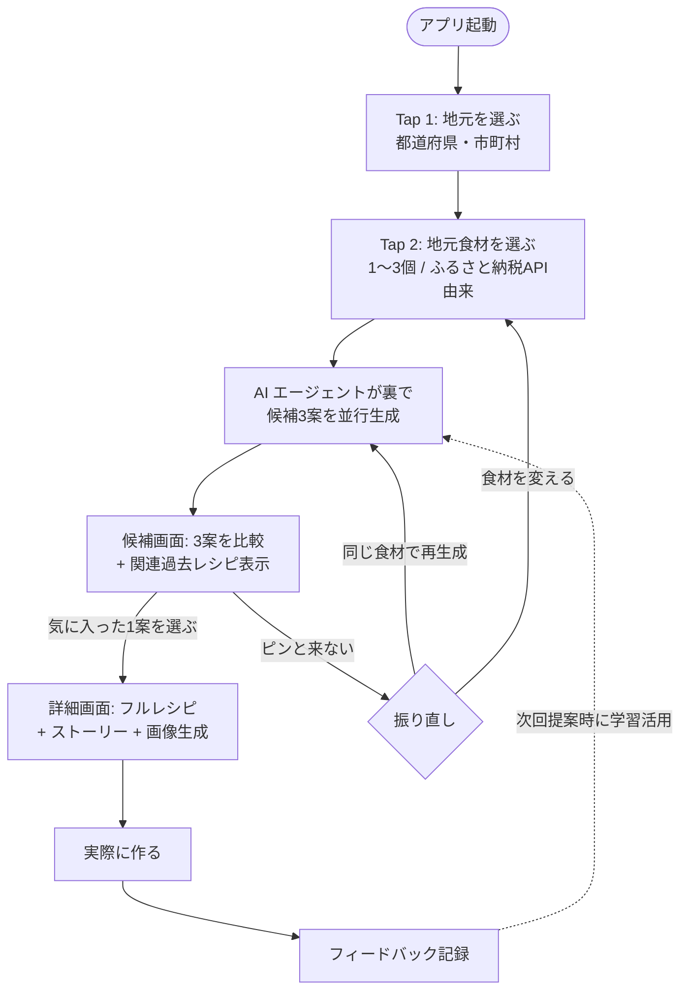

# プロダクト要求定義書（Product Requirements Document）

> 本書は **ふるさとピザ帳** (技術名: MakeLocalPizzaRecipeAgent) の永続的なプロダクト要求を定義する。
> サービス名は 2026-05-24 (Slice 7) に「ふるさとピザ帳」に確定。リポジトリ・GCP リソース等の
> 内部識別子は引き続き MakeLocalPizzaRecipeAgent / makelocalpizzarecipeagent / mlpr-\* を用いる。
> 本プロジェクトは [DevOps × AI Agent Hackathon 2026](hackathon-reference.md) への応募作品として開発される。
> ハッカソン要件・評価軸との整合性は本書全体で考慮されている。
> UI ビジュアル仕様・画面プロトタイプは [`design/MakeLocalPizzaRecipe.html`](../design/MakeLocalPizzaRecipe.html)(静的キャンバス・7画面) および [`design/MakeLocalPizzaRecipe Prototype.html`](../design/MakeLocalPizzaRecipe%20Prototype.html)(動くプロトタイプ) を参照。

---

## 1. プロダクトビジョン

### 1.1 ビジョン
**「地元食材を、2タップで一枚のピザに。」**

ピザは、**ほぼあらゆる食材を主役として受け入れられる**稀有な料理フォーマットである。本プロダクトはその懐の深さを最大限に活かし、ホスト(パーティ主催者)が**地元**と気になる**地元食材**を選ぶだけで、AI エージェントが作ってみたくなるピザレシピを**複数案、ストーリーとともに即座に提示**するサービスである。

ウィザード型の段階的絞込みではなく、**「眺めて1枚を選ぶ」**体験で、思いついた瞬間から数十秒でレシピに到達できる。さらに、リピート利用を前提に、**前回選んだ地元は記憶され、2回目以降は実質1タップで食材選択から開始**できる。使うほど摩擦が小さくなる体験を目指す。

### 1.2 なぜ「ピザ」なのか

数ある料理の中でピザを題材に選んだのは、**食材を受け入れる間口の広さが他の料理を圧倒している**ためである。生地・ソース・トッピングという3層構造は、和洋・甘辛・地域・季節を問わずほぼあらゆる素材を主役として乗せても料理として成立させる、極めて寛容な"器"として機能する。

この特性は本プロダクトの3つの価値を直接的に支えている:

| ピザの特性 | 本プロダクトでの活用 |
| --- | --- |
| **食材組合せの許容度が高い** | 料理素人のユーザーでも「破綻しないアレンジ」が出しやすく、AI 提案の実用性(本当に作れる) が担保される |
| **意外性を演出しやすい** | 普段ピザに乗らない地元食材ほど、ゲストへの驚きと会話のフックが生まれる(C4 への直接的な解) |
| **組合せ探索空間が広い** | AI エージェントが Exploit / Tune / Explore の三軸で多様な案を出す余地が大きく、「AI でしか出せない発想」を体現しやすい |

「地元食材を主役に据える」というコンセプトを最大限引き立てる**器**として、ピザは現時点で最良の選択である。

### 1.3 開発の背景・原体験

本プロダクトは、開発者自身の実体験から生まれている。

宮城県の企業に勤務する開発者が、仙台へ出張で訪れたビジネスパートナーをもてなす場として始めたのが「地元食材ピザパーティ」だった。**せりのピザ**、**牡蠣のピザ**など、地元ならではの食材を載せた一枚を囲むことで、料理そのものが**地元の魅力を共有する話題**となり、ビジネス上の関係性を超えた交流のきっかけになった。

さらにこの取り組みは、開発者自身にとっても**地元の再発見の機会**となった:

- 宮城県が**パプリカの生産量で全国上位**であることを知った
- 地場で**手作りモッツァレラチーズ**を製造している生産者との出会い
- 季節ごとの地元食材を能動的に探し、試すようになった

「地元食材 × ピザ × 共有体験」が**ホストとゲスト双方にとっての発見と交流を生む**という確かな手応えが、本プロダクトの出発点である。**「ふるさとピザ帳」は、この個人的な発見体験を、誰でも・どの地域でも・すぐに再現できる形にして届けることを目指す。**

### 1.4 目的
ビジネスパートナーや友人を招くホームパーティ・カジュアルな集まりで、料理のプロでなくとも、

- **地元の名産品を活かした独創的なピザ**を
- **ゲストとの会話のネタ**になるストーリーとともに
- **数十秒で、複数の候補案から選ぶ形で**得られる

体験を提供する。さらに、実際に作った結果のフィードバックを記録するほど、次回の AI 提案がユーザーの好みを学習しながら、**同時に発想の幅を広げる方向にも振る**ように改善される。

### 1.5 プロダクトのコンセプト(ハッカソンの3コンセプトとの対応)

| ハッカソンコンセプト | 本プロダクトでの体現 |
| --- | --- |
| **つくる** | 2タップで AI エージェントが地元食材から**複数のレシピ案**を自律的に発想・提示。エージェントが裏で地元食材データ取得(ふるさと納税API等)・季節判定・組合せ評価・ストーリー生成・画像生成を自己選択して実行する |
| **まわす** | フィードバック(評価・チップ・写真) を蓄積し、次回提案時に **Exploit(王道) / Tune(改善) / Explore(発散)** の三軸で過去経験を活用。ユーザーは候補画面で AI の学習結果と発想拡張を**目に見える形で確認**できる |
| **とどける** | Cloud Run で安定稼働する Web アプリとして、公開 URL から誰でもアクセスできる形で提供する |

### 1.6 設計上の3つの主張

1. **「入力を絞り込ませる」のではなく「出力を眺めて選ばせる」** — ユーザーの認知負荷をゴール直前(候補比較)に集中させ、それ以前のステップは2タップに圧縮する
2. **エージェントの仕事は"発想空間の探索"** — 単一回答ではなく多様性のある3案を提示することで、AI でしか出せない価値を可視化する
3. **学習ループは隠さず見せる** — 過去フィードバックの活用結果を候補カードの注釈として明示し、「なぜこの提案?」をユーザーが理解できる状態を保つ

---

## 2. ターゲットユーザーと課題

> 本章で挙げるターゲット像と課題群は、§1.3 で述べた開発者自身の実体験(仙台での地元食材ピザパーティ)を通じて実際に観察されたものを中心に整理している。机上の仮説ではなく、ホスト・ゲスト双方の側で確認済みの課題である。

### 2.1 主要ターゲット
**地元食材を活かしたピザでビジネスパートナーや友人をもてなしたいが、レシピ検討に時間をかけたくない個人ホスト**

- 想定ペルソナ:
  - 40代前後、IT/ビジネス職、自宅または小規模オフィスでパーティを主催
  - 仙台などの地方都市在住、地元の食材に誇りを持っている
  - 料理は好きだが料理のプロではない
  - **平日夜・週末の短時間でパーティ準備を済ませたい**(検討に長時間をかけたくない)
  - パーティを通じた人的交流・ネットワーキングを重視
  - スマートフォンでサクッと使える体験を期待

### 2.2 副次的ターゲット(v2 以降)
- 地元食材を活かしたメニュー開発に悩む小規模飲食店
- 食材産地の観光・特産 PR 担当者
- 料理教室・食育イベントの企画者
- 「次の旅行先で何を食べたい/作りたい」を探す旅行者

### 2.3 ユーザーが抱える課題

| # | 課題 | 現状の対処 | 不満点 |
| --- | --- | --- | --- |
| C1 | レシピ考案に時間がかかる | レシピサイト検索 + 自分でアレンジ | 地元食材を活かしたピザ専用レシピが少ない |
| **C2** | **アイデア出しのインプット段階が長い** | 食材選び・テーマ決め・組合せ検討を順番にこなす | **ゴール(完成レシピ)に到達するまでに離脱したくなる** |
| C3 | 食材の組合せの良し悪しが分からない | 経験と勘 | 失敗するとパーティ全体の印象が悪化する |
| C4 | ゲストとの会話のきっかけ作りが難しい | その場の雰囲気任せ | 食材の由来やストーリーを知らないと深い話に発展しない |
| C5 | 過去のパーティでの成功・失敗を活かせない | 記憶に頼る | 反省が次回に活かされず、毎回ゼロから考案 |
| C6 | 仕上がりイメージが湧きにくい | 完成するまで分からない | 当日に「想像と違う」リスク |
| **C7** | **発想が自分の好みに固定化してしまう** | いつも似た組合せを選ぶ | パーティのマンネリ化、新しい挑戦の機会を逃す |

> **C2 と C7 は新仕様で新たに焦点化した課題。** C2 はウィザード型 UX 自体への反省、C7 はフィードバック活用を「学習」だけでなく「発想拡張」にまで広げた本仕様独自の課題設定。

---

## 3. プロダクトの主要機能

### 3.1 全体フロー: Local-first Quick Tap

本プロダクトのユーザー体験は、**2タップで候補3案に到達 → 3タップ目で1案を決定 → 詳細画面でレシピを得る** という極めて短い動線で構成される。



> **リピート利用時のショートカット**: 初回利用後、ユーザーが選んだ地元(都道府県・市町村) は永続化される。2回目以降のセッションでは Tap1 をスキップし、**食材選択(Tap2) から開始**する(実質1タップで候補到達)。地元を変更したい場合(旅行先・引っ越し等) は、Tap2 画面上部の `📍 [地元名] ▾` から再選択できる。

### 3.2 機能一覧(MVP)

| # | 機能名 | 概要 | 対応する課題 |
| --- | --- | --- | --- |
| F1 | **Local-first Quick Tap UX** | 地元選択(Tap1) → 地元食材選択(Tap2) の2タップで候補生成を開始。3タップ目は候補から1案を決定するのみ。**地元選択は永続化され、2回目以降はTap1スキップ(実質1タップで候補到達)**。Tap2画面上部の地元表示から変更可能 | C1, C2 |
| F2 | **地元食材カタログ** | 楽天ふるさと納税API を主データソースとし、選択された地元(都道府県・市町村) の特産食材をカード形式で動的取得・表示 | C1, C3 |
| F3 | **エージェントの自律的なツール選択・実行** | Gemini が地元食材検索・季節判定・組合せ評価・ストーリー生成・画像生成を必要に応じて自律的に呼び出す | (全体 / ハッカソン評価軸①) |
| F4 | **候補3案の並行生成 (Exploit / Tune / Explore)** | 過去フィードバックを参照し、3案を異なる戦略で生成: ①過去傾向に沿った王道 ②過去傾向の延長で少し外す ③過去にない方向で発散 | C5, C7 |
| F5 | **関連過去レシピ表示** | 候補画面で、現在の食材選択と関連性の高い過去レシピを過去フィードバックから抽出して提示 | C5 |
| F6 | **候補振り直し** | 「同じ食材で再生成」「食材を変える」の2択でリトライ可能。Quick Tap 体験を崩さない | C2 |
| F7 | **レシピ詳細出力** | 選択された1案について、食材リスト+分量、ソース・トッピング手順、焼成温度・時間を提示 | C1 |
| F8 | **ストーリー生成** | 食材の産地・生産者・組合せの意図・ゲストへの語り口を含む「話のネタ」テキストを生成 | C4 |
| F9 | **仕上がり画像生成** | 詳細画面遷移時に Imagen で1枚生成(候補画面ではコスト制御のため生成しない) | C6 |
| F10 | **レシピ保存** | 詳細画面で提示されたレシピをユーザー固有のスペースに保存 | C5 |
| F11 | **フィードバック記録** | 実際に作った結果(評価・観点別評価・チップ・写真・コメント) を記録 | C5 |
| F12 | **フィードバック活用ループ** | 蓄積されたフィードバックを次回 F4 (候補3案生成) のコンテキストに自動投入。活用結果は候補カードに注釈表示 | C5, C7 |

### 3.3 候補画面(Tap3) の設計

候補画面は本プロダクトの**心臓部**である。AI の発想力と過去学習が同時に可視化される唯一の画面であり、ユーザーは**完成案を眺めて決定する**だけで意思決定が完了する。

#### 3.3.1 画面構成(ワイヤー)

```
┌──────────────────────────────────────────┐
│ ✨ あなたへの新提案 (3案)                  │
│                                            │
│ ┌────────────────────────┐                │
│ │ Card 1: Exploit (王道)  │                │
│ │  タイトル / 一行コンセプト│                │
│ │  主要食材 / シーンタグ   │                │
│ │  💡 "前回◯◯がウケたので │                │
│ │     今回も同方向"        │                │
│ └────────────────────────┘                │
│                                            │
│ ┌────────────────────────┐                │
│ │ Card 2: Tune (改善・外す)│                │
│ │  ... + 注釈              │                │
│ └────────────────────────┘                │
│                                            │
│ ┌────────────────────────┐                │
│ │ Card 3: Explore (発散)  │                │
│ │  ... + 注釈              │                │
│ └────────────────────────┘                │
├──────────────────────────────────────────┤
│ 📖 過去あなたが作ったレシピ (関連あり)      │
│                                            │
│ [履歴カード: 牡蠣ピザ 2025-12 ★4.5]       │
│ [履歴カード: せりピザ 2025-10 ★3.0]       │
├──────────────────────────────────────────┤
│ [もう一度ふる]  [食材を変える]              │
└──────────────────────────────────────────┘
```

#### 3.3.2 三軸戦略: Exploit / Tune / Explore

過去フィードバックがある場合、エージェントは Gemini に「3案を異なる戦略で生成」と明示的に指示する:

| カード | 戦略 | 過去フィードバックの活用 |
| --- | --- | --- |
| **1. Exploit (王道)** | 過去 high-rating の傾向に沿った堅実な提案 | WHAT WORKED チップ・高評価レシピの食材組合せ・調理法を踏襲 |
| **2. Tune (改善・少し外す)** | 過去傾向の延長で未踏領域に踏み出す | WHAT TO TUNE で繰り返し指摘された軸(塩味・焼成・厚さ等) を意識的に改善 |
| **3. Explore (発散)** | 過去履歴と類似度が低い方向に挑戦 | 過去にない食材組合せ・シーン軸・調理アプローチを選択 |

戦略軸ごとの具体的な食材選定・調理アプローチは Gemini に委ねられており、ハードコードされた組合せロジックではない(ハッカソン評価軸①: エージェントの必然性を満たす)。

#### 3.3.3 過去フィードバック蓄積量による出し分け

| 蓄積件数 | 「過去レシピ」セクション | 3案戦略 |
| --- | --- | --- |
| 0件 | 非表示 | Explore 軸メインで多様性提示(王道 + 攻め + 意外性) |
| 1〜4件 | 表示 + 「もっと記録すると提案精度が上がります」ヒント | Exploit / Tune / Explore 軽量適用 |
| 5件以上 | 表示 + 関連度フィルタでトップ3 | Exploit / Tune / Explore フル活用 |

### 3.4 詳細画面とフィードバック動線

詳細画面では選択された1案について、以下を提示する:

- フルレシピ(食材+分量、ソース・トッピング手順、焼成温度・時間)
- ストーリーテキスト(食材の産地・生産者・組合せ意図・ゲストへの語り口)
- Imagen で生成された仕上がり画像 1 枚

**画像生成はこの画面遷移時に初めて発火する**。候補画面では生成しないことで、API コストを「実際にユーザーが選んだ1案」にだけ集中させる。

画面下部に「**作ってみた**」フィードバック動線をたたみ込み配置する:

- 総合評価(5段階)
- 観点別評価(味 / 見た目 / ストーリー / また作りたい)
- WHAT WORKED / WHAT TO TUNE / GUEST VIBE チップ(多選択)
- 写真・コメント・改善メモ(任意)

→ Quick Tap の主動線(検索 → 候補 → 決定) を汚さない位置に置くことで、**作る前**のユーザー体験は軽量に、**作った後**のユーザーは確実にループに乗せる設計とする。

### 3.5 v2 以降の拡張候補

- 都道府県別・市町村別食材データベースの拡充(ふるさと納税API以外のソース統合)
- マルチユーザー化・レシピ公開/共有機能
- 同食材・同テーマでのレシピ多案バージョン管理
- ショッピングリスト出力・食材調達導線(ふるさと納税ECとの直接連携)
- ボイス対話 (Speech-to-Text / Text-to-Speech)
- ピザ以外の料理フォーマットへの拡張(ピザの寛容性で確立したパターンを他料理に転用)

---

## 4. 成功の定義

### 4.1 ハッカソン審査における成功
本プロジェクトの最重要 KGI は **DevOps × AI Agent Hackathon 2026 における入賞**。

| 審査基準 | 本プロダクトの達成方針 |
| --- | --- |
| ① AI エージェントが価値の中心か(必然性) | 候補3案の並行生成(Exploit / Tune / Explore) は単発 API では実現できない**発想空間の探索**。Gemini がツール選択・過去フィードバック統合・戦略軸ごとの差別化を自律的に行う設計で、「AI でしか出せない複数案」を体現する |
| ② 課題へのアプローチ力 | 開発者自身の実体験(§1.3) を起点とした課題認識。「地元食材ピザを誰でも・どこでも・すぐに再現」というスケール宣言を、Local-first Quick Tap という具体 UX に落とし込んで実装 |
| ③ ユーザビリティ | 初回2タップ・リピート1タップで候補到達。ウィザード型を排し「眺めて選ぶ」体験で、料理素人・スマホユーザーも迷わず使える |
| ④ 実用性・体験価値 | ピザの食材寛容性 × 地元食材 × ストーリー × Exploit/Tune/Explore で、「単なるレシピ生成」を超える発見と交流の体験を提供 |
| ⑤ 実装力(DevOps 実践度) | CI/CD・IaC・可観測性・エージェント評価ループ・コスト制御(画像生成は詳細画面遷移時のみ) を完備し、「まわす」コンセプトを実装で証明 |

### 4.2 プロダクト体験における成功

#### 4.2.1 タップ数・到達時間指標

| 指標 | 初回ユーザー | リピートユーザー(2回目以降) |
| --- | --- | --- |
| 候補3案到達までのタップ数 | **2タップ** | **1タップ** |
| 候補3案到達までの体感時間 | **30秒以内** | **30秒以内** |
| 詳細レシピ + 画像到達までの追加タップ数 | 1タップ(決定) | 1タップ(決定) |
| 詳細レシピ + 画像到達までの追加時間 | **30秒以内** | **30秒以内** |
| トータル(食材を選んでから完成画像まで) | **約60秒〜90秒** | **約30秒〜60秒** |

> **体感レイテンシ低減策**: 候補生成・詳細生成ともに **ストリーム出力 / 段階的ローディング** を活用し、タイトル・コンセプトを先行表示 → 食材・手順・画像を後追いで埋める方式とする。実時間より体感を優先(技術詳細は §9 非機能要件参照)。

#### 4.2.2 体験価値指標

- 生成されたレシピが**実際に作れる**(食材入手可能 / 手順再現可能)
- 生成されたストーリーが**ゲストとの会話のきっかけ**として機能する → **C4 への解**
- フィードバックを蓄積するほど、候補3案の **Exploit / Tune / Explore** の差別化がユーザーから見て**明確に体感**できる
- 5件以上フィードバックが蓄積された状態で、Exploit カードに**ユーザーの好み傾向が明確に反映**される → **C5 への解**
- Explore カードを通じて、ユーザーが**自分の好みの外側で新しい発見**を得る → **C7 への解**

#### 4.2.3 リピート利用指標(MVP では定性把握、v2 以降で本格計測)

- 月内リピート率(同一ユーザーが月内に2回以上使うか)
- ユーザーあたりの平均フィードバック蓄積数
- 「地元を変える」操作の発生頻度(旅行・出張・引っ越しユースケースの確認)
- 同一地元での「振り直し」発生率(候補品質の体感指標として)

---

## 5. ビジネス要件・制約

### 5.1 ハッカソン由来の制約
- **提出締切**: 2026/7/10（金）23:59
- **必須技術**: Google Cloud 実行プロダクト（Cloud Run 等）+ Google Cloud AI（Gemini API / Vertex AI / ADK 等）
- **公開**: GitHub 公開リポジトリ + 動作確認可能なデプロイ URL が必須
- **個人参加**: 所属企業の業務ではなく、個人の私的活動として開発
- **コスト**: 個人負担。Google Cloud の無料枠・スポンサー提供クーポンを最大限活用

### 5.2 開発体制
- **個人開発**（1 人体制）
- 開発期間: 2026/4/29 〜 2026/7/10（約 10 週間）
- Boot Camp（2026/6 月）参加で技術キャッチアップ

### 5.3 公開範囲
- MVP は**ホスト本人の利用想定**で構築(マルチユーザー化は v2)
- ただし、ハッカソンの提出要件として**誰でもアクセスできる公開 URL** で動作させる
- 個人情報・認証は MVP では最小化(必要なら Firebase Auth で Google ログイン程度)

### 5.4 データ永続化スコープ

| データ | MVP の保持先 | v2 以降 |
| --- | --- | --- |
| 地元選択(都道府県・市町村) | **端末ローカル (localStorage)** | クラウド同期(複数端末対応) |
| 最後の食材選択履歴 | 端末ローカル | クラウド同期 |
| レシピ保存 | クラウド(Google ログイン認証時のみ) | 同左 + 公開・共有 |
| フィードバックデータ | クラウド(認証時のみ) | 同左 + 集計可視化 |

**MVP の方針**: 認証なしでも Quick Tap 体験は完全に成立させる。地元選択の永続化(F1) と食材選択は localStorage で完結し、Google ログインは**レシピ保存・フィードバック記録を行いたいユーザーのみオプトイン**。これにより「サクッと試す」初見ユーザーの体験ハードルを最低化する。

---

## 6. ユーザーストーリー

### US-1: パーティ前夜のレシピ考案
> ホストとして、私は仙台オフィスに招くビジネスパートナー向けに、**地元食材を使った独創的なピザを数十秒で**考案したい。なぜなら、その場で会話のネタになり、相手にも喜んでもらえるからだ。

### US-2: 眺めて1案を選ぶ
> ホストとして、私は食材を選んだ後、**AI が提案する複数のレシピ案を眺めて1案を選びたい**。なぜなら、抽象的な雰囲気指定から考えるより、完成案を比較する方が圧倒的に判断が速いからだ。

### US-3: 仕上がりをイメージする
> ホストとして、私は選んだレシピの仕上がりイメージを画像で確認したい。なぜなら、当日「想像と違う」というリスクを避けたいからだ。

### US-4: ストーリーで盛り上げる
> ホストとして、私はピザを出す際にゲストに話せる食材の由来や組合せの意図を知りたい。なぜなら、それが会話のきっかけとなり、より深い交流につながるからだ。

### US-5: 結果を記録する
> ホストとして、私はパーティで実際に作ったピザの評価・ゲストの反応を記録したい。なぜなら、次回のパーティで同じ失敗を繰り返したくないからだ。

### US-6: 学習と発想拡張の両立
> ホストとして、私は AI が過去フィードバックから「**私の好みに沿った王道案**」と「**好みの外側の挑戦案**」の両方を提示してくれるとうれしい。なぜなら、好みに合う安心感と新しい発見の両方が、毎回のパーティの楽しみだからだ。

### US-7: リピート利用での摩擦削減
> ホストとして、私は2回目以降の利用では**地元選択を省略してすぐ食材選びから始めたい**。なぜなら、毎回パーティのたびに使う想定で、繰り返しの操作摩擦を限界まで減らしたいからだ。

### US-8: 別の地元を試す
> ホストとして、私は出張先や旅行先で別の地元の食材ピザも試してみたい。なぜなら、新しい土地の特産品を知り、その土地ならではのもてなしや体験にも応用したいからだ。

---

## 7. 受け入れ条件

### AC-1: Local-first Quick Tap フロー (US-1, US-2, US-7, US-8 関連)
- **初回利用時**: ユーザーは地元(都道府県・市町村) を選択(Tap1) → その地元の食材カードから1〜3個を選択(Tap2) するだけで、AI が候補3案を生成する画面に到達できる
- **2回目以降**: 地元選択は端末ローカル(localStorage) から自動復元され、ユーザーは食材選択(Tap2) から開始できる(実質1タップ)
- Tap2 画面の上部に現在の地元が `📍 [地元名] ▾` 形式で表示され、タップで変更可能(出張・旅行・引っ越し対応)
- 候補3案到達までの体感時間は**30秒以内**(ストリーム出力を含む)
- 候補画面ではいつでも「もう一度ふる(同じ食材で再生成)」「食材を変える(Tap2に戻る)」で振り直し可能

### AC-2: エージェントの自律性 (ハッカソン評価軸①、US-2, US-6 関連)
- エージェントは内部で **2 種類以上のツール** を自律的に選択・実行する(例: 地元食材検索(楽天ふるさと納税API) / 季節判定 / 過去フィードバック検索 / 画像生成)
- 候補3案の差別化軸 (Exploit / Tune / Explore) ごとの具体的な食材選定・調理アプローチは Gemini に委ねられ、ハードコードされた組合せロジックではない
- ツール選択ログ・候補生成ログ・LLM 入出力は Cloud Logging で追跡可能

### AC-3: 候補画面 (Tap3) の表示要件 (US-2, US-6 関連)
- 候補画面には以下が表示される:
  - **3案のレシピカード** (Exploit / Tune / Explore の三軸)
  - 各カードの内容: タイトル / 一行コンセプト / 主要食材 / シーンタグ / **「なぜこの提案か」注釈**
  - (フィードバック1件以上の場合) **関連過去レシピセクション**(履歴カード)
  - **「もう一度ふる」「食材を変える」**振り直しボタン
- 候補カードでは Imagen による画像生成を行わない(コスト制御)
- 3案は**明らかに異なる方向性**を持ち、ユーザーが一目で差別化を認識できる

### AC-4: 関連過去レシピ表示と発散・収束の出し分け (US-5, US-6 関連)
- フィードバック蓄積件数に応じた表示・戦略の切り替え:

| 蓄積件数 | 過去レシピセクション | 3案戦略 |
| --- | --- | --- |
| 0件 | 非表示 | Explore 軸メインで多様性提示(王道+攻め+意外性) |
| 1〜4件 | 表示 + 「もっと記録すると提案精度が上がります」ヒント | Exploit/Tune/Explore 軽量適用 |
| 5件以上 | 表示 + 関連度フィルタでトップ3 | Exploit/Tune/Explore フル活用 |

- 関連度判定(食材重複・シーン重複・季節・評価高低など) はエージェントに委ねる

### AC-5: 詳細画面と画像生成 (US-1, US-3, US-4 関連)
- 候補から1案を選択すると詳細画面に遷移する
- 詳細画面では以下を提示する:
  - フルレシピ(食材リスト + 分量 / ソース・トッピング手順 / 焼成温度・時間)
  - ストーリーテキスト(食材の産地・生産者・組合せの意図・ゲストへの語り口)
  - **Imagen で生成された仕上がり画像 1 枚** (この画面遷移時に**初めて**生成発火)
- 詳細到達までの追加体感時間は **30秒以内**(ストリーム出力含む)
- ストリーム出力により、タイトル → コンセプト → 食材 → 手順 → 画像 の順に段階的に表示される

### AC-6: フィードバック記録 (US-5 関連)
- ユーザーはレシピごとに以下を記録できる:
  - **総合評価** (rating, 5 段階)
  - **観点別評価** (axes): 味 / 見た目 / ストーリー / また作りたい (各 1〜5)
  - **WHAT WORKED** チップ(多選択): 食材の組合せ / ストーリーがウケた / 焼き加減 / 見た目 / 量 / ワインとの相性 等
  - **WHAT TO TUNE** チップ(多選択): 塩味 / 焼成時間 / 生地の厚さ / トッピング量 / 酸味 / 油分 / プレゼン 等
  - **GUEST VIBE** チップ(多選択): 会話が弾んだ / 驚かれた / おかわり続出 / 写真に撮られた / 地元トークに発展 等
  - コメント(自由記述、任意)
  - ゲストの反応(自由記述、任意)
  - 改善メモ(任意)
  - 写真(任意、Cloud Storage に保存)
- フィードバック UI は**詳細画面の下部にたたみ込み配置**され、Quick Tap の主動線を圧迫しない
- 保存完了後、次回提案にどう活用されるかの予告メッセージが表示される(透明性)
- フィードバック保存は Google ログイン認証時のみ可能(MVP の永続化スコープ §5.4 と整合)

### AC-7: フィードバック活用ループと発想拡張 (US-6 関連 / 評価軸②④)
- 次回の候補3案生成時、過去フィードバックがエージェントのコンテキストとして**自動投入**される
- 各候補カードに **「なぜこの提案か」の注釈**(活用された過去フィードバックの要約) が表示される
- 5 件以上蓄積された状態で、**Exploit カードにユーザーの好み傾向が明確に反映**される
- **Explore カードは常に「過去履歴の外側」を狙う設計**で、ユーザーの嗜好の固定化を回避する (C7 への直接的な解)
- 3案の戦略軸(Exploit / Tune / Explore) はカード上のラベル or 視覚的識別でユーザーから明確に判別できる

### AC-8: 公開・デプロイ (ハッカソン要件)
- 公開 URL から**誰でもアクセスできる**(認証なしでも Quick Tap 体験は完結する)
- GitHub 公開リポジトリにソースコード一式が公開されている
- システムアーキテクチャ図が用意されている
- 紹介動画(YouTube または Vimeo) が用意されている
- 動画は §1.3 の原体験エピソード(仙台での地元食材ピザパーティ) を冒頭に組み込み、プロダクトの必然性を示す

---

## 8. 機能要件

### 8.1 Quick Tap UX
- 2タップ動線(Tap1: 地元選択 / Tap2: 食材選択) で候補生成を起動
- 3タップ目は候補画面から1案を決定するのみ
- 地元選択は端末ローカル(localStorage) に永続化し、2回目以降は Tap1 をスキップ
- Tap2 画面上部の地元表示から、いつでも地元を変更可能
- 候補画面では「もう一度ふる(同じ食材で再生成)」「食材を変える(Tap2 に戻る)」で振り直し可能

### 8.2 地元食材カタログ取得
- **楽天ふるさと納税API**を主データソースとし、選択された地元(都道府県・市町村) の特産食材を動的取得
- 食材カードには名称・産地・代表画像(可能であれば) を含む
- レートリミット遵守と短期キャッシュにより、同一地元の再閲覧時の API コール削減
- 障害時は内蔵の静的フォールバックデータセットに切替(主要都道府県の代表食材リスト)

### 8.3 エージェント設計
- **Gemini API** をベースとしたエージェント。**ADK (Agent Development Kit)** または Function Calling でツール呼び出しを実装
- 主要ツール: 地元食材検索(F2) / 季節判定 / 過去フィードバック検索 / レシピ生成 / 画像生成
- 候補3案は構造化出力(JSON) で生成。1コール内で3案を生成 or 3案を並行コール(コスト・レイテンシで比較検討)
- **Exploit / Tune / Explore** の三軸戦略はプロンプト設計で実現し、戦略軸ごとの具体的な食材選定・調理アプローチは Gemini に委ねる

### 8.4 レシピ生成 (2段階出力)
- **候補画面用 (軽量)**: タイトル / 一行コンセプト / 主要食材 / シーンタグ / 注釈
- **詳細画面用 (フル)**: 食材リスト + 分量 / ソース・トッピング手順 / 焼成温度・時間 / ストーリー / 仕上がり画像(Imagen) 1 枚
- 出力は構造化された JSON で取得し、フロントで段階的レンダリング
- 画像生成(Imagen) は**詳細画面遷移時にのみ発火**してコスト管理

### 8.5 データ永続化
- **端末ローカル (localStorage)**: 地元選択(都道府県・市町村) / 最後の食材選択履歴
- **クラウド**: レシピ保存(F10) / フィードバック(F11) / 嗜好プロファイル
- 写真は Cloud Storage に保存

### 8.6 認証 (最小限・オプトイン)
- **認証なしでも Quick Tap 体験は完結** する(初回利用ハードル最低化)
- レシピ保存・フィードバック記録を行うユーザーのみ、**Firebase Auth (Google ログイン)** で認証
- 認証は任意操作で促し、強制しない

---

## 9. 非機能要件

### 9.1 性能・体感レイテンシ
- 候補3案到達: 体感**30秒以内**(ストリーム出力含む)
- 詳細レシピ + 画像到達: 候補画面からさらに**30秒以内**
- **ストリーム出力 / 段階的レンダリング**を必須:
  - 候補画面: タイトル → 一行コンセプト → 主要食材 → 注釈 の順で先行表示
  - 詳細画面: タイトル → 食材 → 手順 → ストーリー → 画像 の順で順次表示
- 体感を優先するため、全データが揃ってからのまとめ表示は避ける

### 9.2 可用性
- ハッカソン審査期間(2026/7/10〜2026/7/24) は確実に動作している必要がある
- Cloud Run の自動スケーリングを活用し、審査時の同時アクセスにも耐える

### 9.3 可観測性 (DevOps 評価軸)
- すべての API 呼び出し・エージェントのツール選択・LLM 入出力は Cloud Logging に記録
- レイテンシ・エラー率は Cloud Monitoring で可視化
- **Exploit / Tune / Explore 戦略軸ごと**のレスポンス品質と所要時間を別々にモニタリング(品質改善のループに活用)
- 異常時のアラート設定

### 9.4 セキュリティ
- Gemini API キー・楽天 API キー等の認証情報は **Secret Manager** で管理
- フロントから Gemini / 楽天 API を直接呼び出さず、必ず **BFF 経由**
- ユーザー入力のサニタイズ(XSS 対策)
- localStorage に保存するデータは個人特定情報を含めない(地元・食材選択履歴のみ)

### 9.5 コスト
- 個人負担の範囲内(月数千円〜1 万円程度を上限) に収まるよう、Gemini API・Imagen の呼び出し頻度を制御
- **画像生成は詳細画面遷移時の1枚のみ**(候補画面では生成しない)
- 楽天ふるさと納税APIの結果は**短期キャッシュ**で同一地元の再閲覧時のコスト削減
- 候補3案の生成方式(1コール vs 3コール並行) はコスト・レイテンシ計測で決定

### 9.6 外部 API 依存と耐障害性
- **楽天ふるさと納税API** の障害時は内蔵の**静的フォールバックデータセット**(主要都道府県の代表食材) に切替し、Quick Tap 体験を継続させる
- フォールバック動作時は UI 上で「現在オフライン食材データを利用中」と明示
- Gemini / Imagen API 障害時はリトライ + ユーザー通知

### 9.7 拡張性
- v2 でのマルチユーザー化を見据え、データモデルにユーザー ID を持たせる
- 食材検索ツールは**インターフェース化**し、ふるさと納税API 以外のソース(都道府県オープンデータ等) を後付けで追加可能
- ピザ以外の料理フォーマットへの転用を見据え、「料理フォーマット」を抽象化した設計

### 9.8 デプロイ・運用 (DevOps 評価軸)
- インフラは **Terraform で完全に IaC 化**
- **GitHub Actions** による CI/CD パイプライン(テスト → ビルド → デプロイ)
- main ブランチへのマージで Cloud Run へ自動デプロイ
- エージェントの応答品質を定期評価する仕組み(**Vertex AI Gen AI Evaluation Service** 等の活用検討) を導入し、Exploit / Tune / Explore 軸別に品質を計測

---

## 10. 想定されるリスクと対策

| # | リスク | 対策 |
| --- | --- | --- |
| R1 | 提出期限までに DevOps 全体を実装しきれない | MVP のスコープを Quick Tap + 候補3案 + 詳細画面 + フィードバック記録に絞り、機能の幅より DevOps 完成度を優先 |
| R2 | Gemini API / Imagen のコスト超過 | 画像生成は詳細画面遷移時の1枚のみ、ふるさと納税API のキャッシュ、レート制限、Boot Camp クーポンの活用 |
| R3 | 候補3案の品質が安定しない / 差別化が見えない | Exploit/Tune/Explore のプロンプト設計を Boot Camp で反復改善。Vertex AI Gen AI Evaluation で軸別に品質を計測 |
| R4 | 個人開発で時間が足りない | Boot Camp 参加・テンプレート活用・Claude Code 等の AI 開発支援を活用 |
| R5 | "AI エージェントの必然性" が弱く見える | Exploit/Tune/Explore の三軸を**候補カード上のラベル + 注釈**として視覚的に明示、紹介動画でも強調 |
| **R6** | **楽天ふるさと納税API の制約・障害でカタログ機能が破綻** | キャッシュ + 内蔵静的フォールバックデータセット、フォールバック時の UI 明示で Quick Tap 体験を継続 |
| **R7** | **リピート利用が想定通り発生せず単発体験で終わる** | 地元選択の永続化と摩擦最小化で繰り返し障壁を下げ、紹介動画でリピート利用シーン(出張先での地元変更等) も訴求 |

---

## 11. 用語

ユビキタス言語の詳細は `docs/glossary.md` で別途定義予定。本書での主要用語:

- **ホスト** — パーティを主催するユーザー(本プロダクトの主要ユーザー)
- **ゲスト** — パーティに招かれる人。ビジネスパートナーを含む
- **地元 (Local)** — ユーザーが Tap1 で選択する地理的範囲(都道府県・市町村単位)。永続化対象
- **地元食材** — 選択された地元の特産食材。楽天ふるさと納税API を主データソースとして取得
- **レシピ** — エージェントが提案する 1 つのピザの完全な情報(食材・手順・ストーリー・画像)
- **候補3案** — エージェントが Tap2 完了後に Exploit / Tune / Explore の三軸で並行生成する3つのレシピ提案
- **Quick Tap** — 本プロダクトの中心 UX。2タップで候補生成 + 3タップ目で決定。リピート時は実質1タップ
- **Exploit / Tune / Explore** — 過去フィードバックを **王道追求 / 改善・少し外す / 発散・新発見** の三軸で活用する候補生成戦略
- **フィードバック** — ホストが実際に作った後に記録する評価・観点別評価・チップ(WHAT WORKED / WHAT TO TUNE / GUEST VIBE) ・写真・コメント
- **エージェント** — Gemini をコアとし、ツール(地元食材検索・季節判定・過去フィードバック検索・画像生成等) を自律的に呼び出して候補3案を生成する AI

---

## 12. 改訂履歴

| 日付 | 版 | 変更内容 |
| --- | --- | --- |
| 2026-04-29 | 1.0 | 初版作成(プロダクト名: MakePizzaRecipeAgent、対話型 3UX 切替) |
| 2026-05-12 | 2.0 | **全面リフレッシュ**。プロダクト名を **MakeLocalPizzaRecipeAgent** に変更。対話型/ウィザード UX を廃止し **Local-first Quick Tap (初回2タップ・リピート1タップ)** に一本化。**Exploit / Tune / Explore の三軸並行候補生成**を中心機能に据え、フィードバック活用を「学習」だけでなく「発想拡張」にも明示的に振る設計を導入。原体験(§1.3 仙台ピザパーティ) を追加、なぜピザかの設計判断(§1.2) を明文化。楽天ふるさと納税API を地元食材カタログの主データソースに昇格。地元選択の localStorage 永続化、画像生成の詳細画面遷移時集中によるコスト制御、ストリーム出力による体感レイテンシ最適化を要件化。AC-1〜AC-8 と US-1〜US-8 を再構成。 |
| 2026-05-24 | 2.1 | **サービス名を「ふるさとピザ帳」に確定** (Slice 7、FR-7-8)。表向きのブランド名としてユーザ露出箇所 (env / metadata / TOP / README) に展開。技術識別子 (リポジトリ名 MakeLocalPizzaRecipeAgent / GCP プロジェクト makelocalpizzarecipeagent / mlpr-\* リソース prefix) は引き続き既存値を保持。 |
